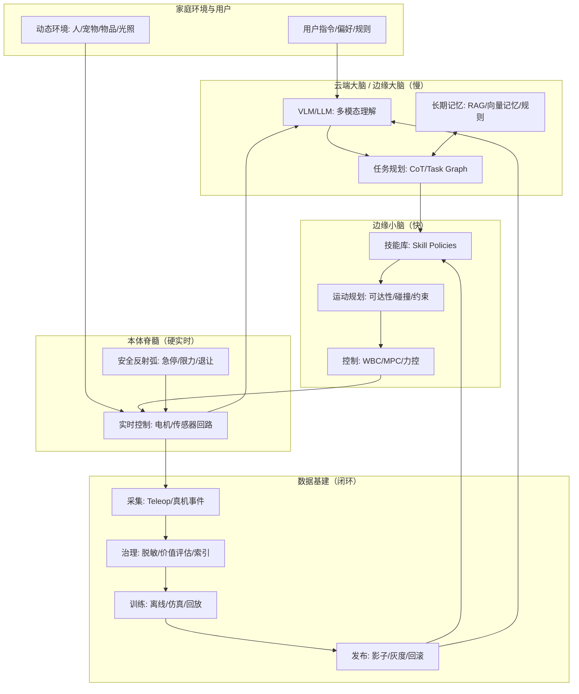

# 具身智能通用家庭机器人技术路线说明文档

**版本**：3.0  
**日期**：2026-01  
**适用对象**：机器人研发团队、系统架构师、算法团队、产品/交付团队、技术决策者  

---

## 目录

1. [执行摘要](#1-执行摘要)
2. [需求分析：目标场景、任务集与功能边界](#2-需求分析目标场景任务集与功能边界)
3. [产品与能力演进路线（G1→G3）](#3-产品与能力演进路线g1g3)
4. [总体技术架构（云端大脑/边缘小脑/本体脊髓/数据基建）](#4-总体技术架构云端大脑边缘小脑本体脊髓数据基建)
5. [关键技术系统设计（分层详解）](#5-关键技术系统设计分层详解)
6. [数据闭环体系（对齐本仓库闭环设计）](#6-数据闭环体系对齐本仓库闭环设计)
7. [安全、隐私、合规与伦理（家庭场景硬门槛）](#7-安全隐私合规与伦理家庭场景硬门槛)
8. [评测体系与KPI（可回归、可灰度、可量产）](#8-评测体系与kpi可回归可灰度可量产)
9. [工程实施路线与里程碑（从原型到量产）](#9-工程实施路线与里程碑从原型到量产)
10. [风险清单与破局策略](#10-风险清单与破局策略)
11. [参考文献与资源](#11-参考文献与资源)

---

## 1. 执行摘要

具身智能通用家庭机器人（General-Purpose Embodied AI Home Robot）的目标，是在**强隐私、强动态、强长尾**的家庭环境中，实现从“能完成少数任务的工具”向“可理解、可协作、可长期稳定运行的家庭伙伴”演进。

家庭机器人落地的关键，不是单点算法的 SOTA，而是**系统工程闭环**：

- **分层智能**：大脑（语义理解/任务推理）+ 小脑（技能/控制）+ 脊髓（实时安全反射）
- **数据飞轮**：以高价值事件驱动（失败/不确定/新颖）采集数据并持续迭代
- **安全与合规内生**：宁可失败也不伤人；默认隐私保护；可审计、可回滚

本路线以“**移动操作复合体（轮式/轮足 + 单/双臂）优先**，人形为中长期目标”为基本策略：先在半结构化家庭区域（厨房、洗衣区、客厅整理）形成可靠能力闭环，再扩展到更通用形态与任务集合。

---

## 2. 需求分析：目标场景、任务集与功能边界

### 2.1 目标场景（按落地优先级）

- **高频家务**：取送物品、整理收纳、简单清洁辅助（擦拭/收集/分类）
- **照护与安全**：老人/儿童看护（提醒、巡检、异常事件上报）、紧急取物
- **家庭协作**：与人协作完成长任务（备餐辅助、洗衣流程辅助、收纳流程辅助）
- **智能家居联动**：灯光/空调/门锁/摄像头联动（由机器人作为“移动交互入口”）

### 2.2 典型任务形态（从短到长）

- **短任务（<30s）**：到达指定位置、识别物体、抓取/放置一次
- **中任务（30s–5min）**：导航+开关门/抽屉+取放物+回收工具
- **长任务（>5min，>10步）**：例如“准备早餐并收拾桌面”“洗衣流程：取衣→分拣→放入→启动→晾晒”

### 2.3 功能边界（必须明确，避免“伪通用”）

建议在PRD/安全评审中显式写清以下边界：

- **高风险物体**：刀具、明火、热液体、药品等默认“受限/需确认/需人类在回路”
- **高风险动作**：攀爬、上楼梯、搬运超重物、强力推拉等默认禁用或需场景改造
- **隐私区域**：卧室/卫生间/儿童房等默认禁区或需显式授权
- **断网策略**：断网时保留的能力范围（至少保留安全反射弧与基础导航/停靠）

---

## 3. 产品与能力演进路线（G1→G3）

参考自动驾驶分级思想，给出三阶段路线（阶段名称可按团队习惯调整）：

### 3.1 G1：专用技能验证期（0–12个月）

**目标**：在半结构化环境中可靠完成少量高频任务。  
**形态**：轮式/轮足底盘 + 单/双臂 + 两指夹爪（优先可靠性）。  
**技术特征**：

- 遥操作采集数据 + 模仿学习（BC/扩散策略）形成技能
- 任务拆解以规则/技能编排为主，VLM/LLM 做语义解析与意图映射
- 打通数据闭环：采集→脱敏→评估→训练→影子→灰度→回滚

**交付物**：原型机 + 闭环系统 + 任务集基准（Task Set v1）。

### 3.2 G2：多技能与半自主期（12–24个月）

**目标**：具备几十个原子技能并能组合执行中长任务，具备一定抗扰与恢复能力。  
**形态**：移动操作复合体 + 更好的末端（简化灵巧手/力控/基础触觉）。  
**技术特征**：

- 引入 VLA/VLM-Policy 进行更强泛化的高层规划
- Sim2Real + 真实数据融合，建立“恢复策略库（Recovery Skills）”
- 端云协同更成熟：端侧可离线完成核心任务与安全策略

**交付物**：MVP 产品 + 小规模家庭内测 + 指标面板（安全/体验/成功率）。

### 3.3 G3：通用自主期（24个月+）

**目标**：理解模糊指令，自主拆解长任务，持续学习，个性化服务。  
**形态**：更高自由度（可能走向人形/轮足人形），但以可靠性与成本为前提。  
**技术特征**：

- 具身基础模型（Foundation Model）主导：更强世界模型/物理推理/长时记忆
- 云端持续进化（模型、知识、策略）与强合规运维体系并行

**交付物**：规模化量产与运维体系，形成“家庭级”可靠性指标（MTBF、回滚、数据治理）。

---

## 4. 总体技术架构（云端大脑/边缘小脑/本体脊髓/数据基建）

采用分层架构：**云端大脑（慢思考）+ 边缘小脑（快执行）+ 本体脊髓（硬实时与安全反射）+ 数据基建（飞轮）**。



---

## 5. 关键技术系统设计（分层详解）

本章按“实体层→系统软件→算法层（感知/规划/控制）→交互”的顺序展开，强调可落地接口与约束。

### 5.1 实体层（Body）：硬件形态与传感/执行

#### 5.1.1 形态建议

- **优先**：移动操作复合体（轮式/轮足）  
  - 优点：能效高、维护成本低、工程风险更可控
  - 适用：大多数家庭任务（台面/柜面/地面）
- **中长期**：更高自由度形态（可包含人形能力）  
  - 价值：更适配“为人设计”的环境（门把手、开关、楼梯）
  - 风险：成本、可靠性、续航、安全认证压力显著上升

#### 5.1.2 传感器最小集合（MVP）

- **视觉**：头部/胸部 RGB-D + 腕部近距 RGB
- **定位避障冗余**：低位 2D LiDAR（桌腿/低矮障碍）+ 超声/红外（玻璃门/镜面补盲）
- **本体状态**：IMU、关节/轮子编码器、电流/温度、碰撞条（bumper）
- **交互**：麦克风阵列 + 扬声器 + 状态指示灯

#### 5.1.3 末端执行器演进

- **阶段一**：两指夹爪（可靠性与成本优先）
- **阶段二**：简化灵巧手 + 末端力/力矩传感（提高鲁棒性）
- **阶段三**：高自由度灵巧手 + 触觉（追求更广泛操作泛化）

> 触觉方向可参考 GelSight 类视触觉传感器（见参考链接）。

### 5.2 系统软件层：OS/中间件/总线与可观测性

#### 5.2.1 软件栈建议

- **OS**：Linux（必要时使用实时内核/隔离核）  
- **中间件**：ROS 2（组件化、消息、工具链成熟）  
- **数据录制与回放**：rosbag2/MCAP（便于高价值片段存储与回放评估）

#### 5.2.2 通信与实时

- **内部总线**：EtherCAT / CAN-FD（按成本与实时性选择）
- **实时域隔离**：把“硬实时控制域”与“非实时推理域”隔离（进程/核/总线）

#### 5.2.3 可观测性（强烈建议一开始就做）

- **指标**：碰撞/急停/接管率、任务成功率、时延、温度与功耗
- **回放**：所有线上事故必须可回放复现（日志 + 关键帧 + 控制指令）

### 5.3 感知与世界模型（Perception & World Model）

#### 5.3.1 3D 语义地图（建议分层）

- **几何层**：占据栅格/TSDF/点云
- **语义层**：房间/家具/物体类别与属性（易碎、液体、可倾倒、可抓取）
- **动态层**：人/宠物/移动物体的短时预测（用于避让与礼让）

#### 5.3.2 家庭长期记忆（RAG + 规则 + 审计）

家庭强个性化，长期记忆需覆盖：

- **空间记忆**：“药在床头柜第二层”“垃圾桶在厨房门后”
- **偏好与规则**：“不要进儿童房”“夜间静音”“老人模式降速”

工程建议：

- 向量记忆库（图像关键帧/语义地图片段嵌入）
- 结构化规则层（禁区、模式、上限）
- 可审计证据链（检索命中 + 规则命中 + 置信度）

### 5.4 认知与规划（Cognition & Planning）

#### 5.4.1 推荐中间表示：任务图（Task Graph）+ 技能调用（Skill Call）

大脑不直接输出低层控制，而输出**可校验、可回滚**的技能序列：

- **任务图**：DAG/状态机；节点是技能；边是前置条件与失败恢复
- **技能调用**：标准输入/输出、超时、成功判定、fallback

示例（Skill Call）：

```json
{
  "skill": "Pick",
  "inputs": {
    "object_id": "milk_carton",
    "grasp_hint": "side_grasp",
    "constraints": { "max_force_n": 8, "keep_upright": true }
  },
  "success_criteria": ["object_in_gripper", "slip_detected==false"],
  "timeout_s": 20,
  "fallback": ["Regrasp", "AskHumanHelp"]
}
```

#### 5.4.2 规划策略：分层优先，端到端渐进

- **早期可落地**：VLM/LLM 做意图解析与任务拆解；技能库完成执行
- **中期增强**：引入 VLA（视觉-语言-动作）模型提升未见物体/未见组合任务泛化
- **长期方向**：世界模型做“执行前预演（Plan-before-Act）”，降低高风险动作事故率

参考方向（用于理解范式，不代表唯一选型）：RT-2、SayCan、VoxPoser、OpenVLA（见参考链接）。

### 5.5 小脑层：运动控制、技能策略与恢复

#### 5.5.1 控制栈分层（建议）

| 子层 | 频率 | 目标 |
| --- | --- | --- |
| 安全反射弧 | 500–1000Hz | 急停/限力/退让/让行 |
| 控制层 | 100–500Hz | 关节/轮速/力控闭环（WBC/MPC/阻抗） |
| 技能策略层 | 10–50Hz | 抓取/放置/开门等技能内部策略 |
| 运动规划层 | 1–10Hz | 可达性/碰撞/约束下的轨迹生成 |

#### 5.5.2 技能库最小集合（MVP）

- 导航：`NavigateTo(room/object/pose)`、`Approach(object)`、`Dock()`
- 操作：`Pick()`、`Place()`、`OpenDoor()`、`PullDrawer()`、`Wipe(area)`
- 安全：`EmergencyStop()`、`Backoff()`、`YieldToHuman()`
- 恢复：`Regrasp()`、`RetryWithNewView()`、`AskHumanHelp()`

#### 5.5.3 模仿学习 / 扩散策略 / 强化学习：分工建议

- **模仿学习（BC/扩散策略）**：家庭操作（Manipulation）主力路线，样本效率更高
- **强化学习（RL）**：高动态能力（越障/平衡/极端恢复）与仿真中危险探索
- **Sim2Real**：用域随机化/噪声建模/少量真机微调缩小差距

### 5.6 交互与体验（HRI）：信任、可控、可解释

家庭场景的“好用”往往来自三件事：

- **可预期**：机器人动作速度、避让策略、路径选择稳定一致
- **可打断**：任意时刻“暂停/停止/退让/返回”
- **可解释**：关键动作给出简短原因（命中的规则/检索到的历史经验/风险评估）

---

## 6. 数据闭环体系（对齐本仓库闭环设计）

本仓库已包含更详细的闭环系统设计文档：`具身智能轮式家庭通用机器人数据闭环系统设计.md`。本章只给出与“通用家庭机器人路线”直接相关的落地要点与接口建议，强调**安全优先 + 隐私内生 + 可回滚可审计**。

### 6.1 F.U.N 触发：只录“高价值片段”，不做全量监控

端侧触发类型建议至少包含：

- **Failure（失败）**：抓取失败、物体掉落、导航卡滞、任务超时
- **Uncertainty（不确定）**：策略置信度低、动作分歧大、反复犹豫
- **Novelty（新颖）**：与历史记忆相似度低（新物体/新遮挡/新户型）
- **HITL（人类干预）**：语音打断、手动接管、强制停止
- **Safety（安全事件）**：碰撞、急停、跌落风险、过载

### 6.2 Episode 封装（前后缓冲 + 多模态同步）

推荐每个 Episode 包含：

- pre-buffer 5–15s，post-buffer 3–10s
- RGB/RGB-D、里程计、IMU、关节状态、末端力/力矩、规划/决策日志、交互事件

### 6.3 数据分级与隐私（默认“敏感原始数据不出家”）

| 等级 | 内容 | 默认策略 |
| --- | --- | --- |
| L1 | 原始连续音视频流 | 不落盘/不上传（仅用于实时） |
| L2 | 脱敏关键帧/短片段 | 触发时缓存、脱敏后可上传 |
| L3 | 结构化元数据与指标 | 可常态上传 |

### 6.4 发布：影子模式 + 灰度闸门 + 自动回滚

建议发布流程：

1. 离线回放评估（黄金集回归）  
2. 仿真压力测试  
3. 影子模式（真机并行推理不控制）  
4. 安全区验证  
5. 灰度发布（1%→10%→50%→100%）  

回滚触发（示例）：

- 碰撞率/急停率超过阈值
- 人类接管率显著上升
- 关键任务成功率明显下降

---

## 7. 安全、隐私、合规与伦理（家庭场景硬门槛）

### 7.1 三层安全体系（硬件/控制/决策）

1. **硬件层**：急停、限力、限速、碰撞检测、扭矩监测、软包覆材料  
2. **控制层**：安全距离约束、速度规划、力控上限、碰撞预测、退让策略  
3. **决策层**：高风险动作二次确认；儿童/老人模式；禁区规则；“停-退-求助”  

### 7.2 隐私与数据治理

- 默认最小化采集与上传（见第6章分级）
- 用户可控：物理开关、上传策略配置、数据导出与删除
- 访问审计：数据访问/策略更新/远程控制必须可追溯

### 7.3 标准与认证（建议从一开始就对齐）

家庭/个人照护机器人安全可参考 ISO 13482 等相关标准入口（见参考链接）。  
实际认证路径需结合目标市场法规与产品形态（移动平台/有无操作臂/是否具备医疗属性等）。

---

## 8. 评测体系与KPI（可回归、可灰度、可量产）

### 8.1 评测层级

- **离线回放评估**：固定“黄金集（Golden Set）”做版本回归
- **仿真压力测试**：大规模随机场景；验证长尾与极端工况
- **影子模式评估**：真机并行推理不执行；比较风险与策略差异
- **线上监控评估**：灰度发布后的指标面板与报警

### 8.2 核心KPI（建议起步值，需按团队能力校准）

安全（优先级最高）：

- 碰撞次数/小时、急停次数/小时（按场景分层统计）
- 人类接管率（按任务/时间段/家庭模式统计）
- 高风险动作确认率与拒绝率（是否“敢拒绝”）

性能：

- 任务成功率（短/中/长任务分层）
- 失败恢复率（失败后无需人工介入仍可继续）
- 平均完成时间与路径效率（不扰民、不过度绕路）

体验：

- 打断成功率（暂停/停止/退让）
- 交互成功率（语音理解、指令澄清次数）
- 用户满意度/NPS（可选）

---

## 9. 工程实施路线与里程碑（从原型到量产）

### 9.1 建议的推进顺序（避免“先造大而全硬件”）

1. **先建数据工场与闭环**：没有飞轮，模型与系统只能停在 demo  
2. **先做任务集与基准**：明确 20–50 个任务的成功判据与回归集  
3. **先用成熟硬件平台验证算法**：避免硬件不确定性拖垮节奏  
4. **再逐步定型硬件与量产工程**：当任务集稳定、指标稳定后再收敛形态  

### 9.2 阶段里程碑（示例）

- M1：完成端侧录制/脱敏/上传与黄金集回放评估  
- M2：实现三项闭环任务（取送物品、定点整理、安全导航）并达到安全门槛  
- M3：上线影子模式与灰度发布；具备自动回滚能力  
- M4：引入恢复策略库；长任务成功率进入可用区间  
- M5：小规模家庭内测→试产→量产导入（可靠性/噪音/续航/维护）

---

## 10. 风险清单与破局策略

- **数据稀缺与偏差**：用 F.U.N 触发 + 黄金集回归 + 人工审核高价值失败片段
- **实时性矛盾**：端云协同；硬实时域隔离；关键安全动作端侧闭环
- **Sim2Real 翻车**：仿真补长尾，真机为主数据；影子模式挡风险；灰度与回滚
- **大模型幻觉/不当决策**：可执行性检查（可达/碰撞/力控约束）+ 高风险确认 + 停-退-求助
- **隐私不信任**：默认本地化 + 物理开关 + 可删除可导出 + 审计透明
- **硬件可靠性与维护**：模块化、健康监测、标准化维护流程、以 MTBF 作为硬门槛推进

---

## 11. 参考文献与资源

### 11.1 论文/方法（入口）

- RT-2（Vision-Language-Action）：`https://arxiv.org/abs/2307.15818`
- SayCan（Do As I Can, Not As I Say）：`https://arxiv.org/abs/2204.01691`
- VoxPoser：`https://arxiv.org/abs/2307.05973`

### 11.2 工程与工具（入口）

- ROS 2 Humble 文档：`https://docs.ros.org/en/humble/index.html`
- NVIDIA Isaac Sim 文档：`https://docs.omniverse.nvidia.com/isaacsim/latest/index.html`
- MCAP 数据格式：`https://mcap.dev/`

### 11.3 标准（入口）

- ISO 13482:2014 Personal care robots — Safety requirements：`https://www.iso.org/standard/53820.html`

### 11.4 本仓库相关文档

- `具身智能轮式家庭通用机器人数据闭环系统设计.md`（闭环系统细化：F.U.N、云边端、影子/灰度/回滚、隐私内生）


