# 具身智能通用家庭机器人技术路线说明文档

**版本**：2.0  
**日期**：2025年1月  
**适用对象**：机器人研发团队、系统架构师、技术决策者、投资者

---

## 文档目录

### 第一章：概述与愿景

- 1.1 项目背景与发展趋势
- 1.2 核心定义与目标
- 1.3 家庭场景核心挑战
- 1.4 市场规模与发展前景

### 第二章：总体技术架构

- 2.1 四层体系架构概览
- 2.2 大脑层（Cognition）：认知与规划
- 2.3 小脑层（Control）：运动控制
- 2.4 实体层（Body）：硬件本体
- 2.5 数据层（Data）：数据基建
- 2.6 安全与伦理框架

### 第三章：核心技术路线详解

- 3.1 大脑层关键技术
  - 3.1.1 视觉-语言-动作（VLA）模型
  - 3.1.2 思维链规划（CoT Planning）
  - 3.1.3 世界模型与数字孪生
- 3.2 小脑层关键技术
  - 3.2.1 扩散策略（Diffusion Policy）
  - 3.2.2 强化学习与Sim2Real
  - 3.2.3 全身协调控制（WBC）
- 3.3 实体层关键技术
  - 3.3.1 硬件形态演进
  - 3.3.2 感知系统
  - 3.3.3 灵巧手与触觉技术
- 3.4 数据层关键技术
  - 3.4.1 低成本遥操作采集
  - 3.4.2 仿真合成数据
  - 3.4.3 数据飞轮与持续学习

### 第四章：分阶段发展规划

- 4.1 第一阶段（2025-2027）：基础能力筑基
- 4.2 第二阶段（2028-2029）：场景协同进化
- 4.3 第三阶段（2030+）：通用家庭伙伴

### 第五章：产业实践与技术路线对比

- 5.1 三大主流技术路线对比
- 5.2 国际企业发展动态
- 5.3 中国企业差异化路径
- 5.4 代表性VLA模型对比

### 第六章：关键挑战与破局策略

- 6.1 数据匮乏与质量问题
- 6.2 推理延迟与实时性矛盾
- 6.3 安全与伦理风险
- 6.4 硬件成本与可靠性瓶颈
- 6.5 法规标准缺失

### 第七章：总结与展望

- 7.1 核心结论
- 7.2 技术切入建议
- 7.3 未来展望

---

## 附录

- 附录A：关键术语表
- 附录B：参考资料来源
- 附录C：技术架构图

---

> **说明**：本文档基于2024-2025年最新行业研究报告、产业动态以及学术论文整理，旨在为研发团队提供清晰的架构设计、阶段规划及关键技术选型参考。

---

# 01_概述与愿景.md

# 第一章：概述与愿景

## 1.1 项目背景与发展趋势

近年来，随着人工智能和机器人技术的突破性发展，**"具身智能"（Embodied AI）**已成为机器人领域的核心发展方向。具身智能区别于传统AI的标志在于：它不仅能"思考"，更能在物理世界中"行动"——通过感知、理解、决策并执行真实的物理任务。

家庭服务机器人作为具身智能最复杂、最具挑战性的应用场景之一，被业界誉为具身智能的"圣杯"。它要求机器人具备环境感知、语义理解、推理决策和复杂物体操作等综合能力，并能在高度非结构化的家庭环境中安全、鲁棒、自主地完成任务。

### 1.1.1 行业发展时间线

| 时间节点 | 里程碑事件 |
|---------|-----------|
| 2023年 | Google DeepMind发布RT-2，首次实现视觉-语言-动作模型端到端控制 |
| 2024年 | OpenVLA开源发布，VLA模型民主化；人形机器人进入"商业化量产元年" |
| 2025年 | "具身智能"首次写入中国政府工作报告；VLA成为机器人大脑主流架构 |
| 2025年 | NVIDIA发布GR00T N1，Figure AI发布Helix双系统架构 |
| 2025年12月 | 工信部成立人形机器人与具身智能标准化技术委员会 |

### 1.1.2 市场规模预测

- **2024年**：中国家用智能机器人市场规模达**548亿元**
- **2025年**：中国市场预计突破**千亿级**，全球具身智能市场估值**32.4亿美元**
- **2029年**：全球市场预计增长至**63.2亿美元**
- **2030年**：家庭机器人全球市场有望突破**240亿美元**

---

## 1.2 核心定义与目标

### 1.2.1 通用家庭机器人定义

**通用家庭机器人（General-Purpose Household Robot）**指能够在非结构化家庭环境中，通过多模态感知理解用户意图，自主决策并执行复杂物理操作的智能终端。它不仅仅是被动响应指令的"工具"，更是具备认知能力、能主动服务的"家庭成员"。

### 1.2.2 核心能力目标

```
┌─────────────────────────────────────────────────────────────────┐
│                    通用家庭机器人核心能力体系                      │
├─────────────────────────────────────────────────────────────────┤
│  感知层：环境理解 → 物体识别 → 空间认知 → 人体姿态感知               │
│  认知层：自然语言理解 → 任务规划 → 常识推理 → 情境判断               │
│  执行层：导航移动 → 物体操作 → 工具使用 → 精细控制                   │
│  交互层：语音对话 → 情感识别 → 个性化适应 → 主动服务                 │
└─────────────────────────────────────────────────────────────────┘
```

### 1.2.3 技术目标演进

| 阶段 | 定位 | 核心能力描述 |
|------|------|-------------|
| **第一阶段** | "能干活" | 完成特定指令（取物、清洁），自主导航成功率>98% |
| **第二阶段** | "懂生活" | 理解模糊指令，多任务协同，形成个性化服务模式 |
| **第三阶段** | "有灵魂" | 因果推理，情感连接，成为家庭不可或缺的"伙伴" |

---

## 1.3 家庭场景核心挑战

家庭环境是机器人研发的"珠穆朗玛峰"，相比工业场景面临更为严峻的技术挑战：

### 1.3.1 三大核心矛盾

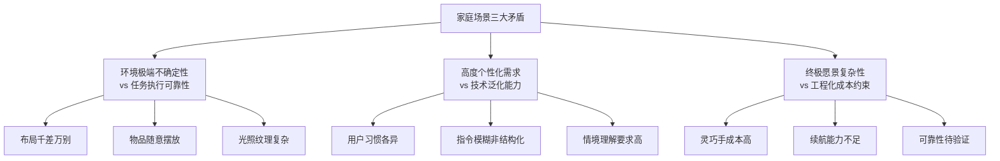

### 1.3.2 具体技术难点

| 挑战维度 | 具体表现 | 技术要求 |
|---------|---------|---------|
| **环境感知** | 家庭布局各异，物品摆放随机，光照变化大 | 环境自适应，开放词汇物体识别 |
| **任务理解** | 指令通常模糊（如"收拾一下桌子"），涉及长序列操作 | 语义理解+常识推理+任务分解 |
| **安全交互** | 与老人、儿童共存，要求物理柔顺和被动安全 | 力控精度0.1N，碰撞响应<10ms |
| **成本控制** | 需控制在普通家庭可接受价格（理想<5万元） | 硬件标准化，算法轻量化 |
| **隐私保护** | 机器人持续采集音视频等敏感数据 | 边缘计算，数据本地化处理 |

---

## 1.4 市场规模与发展前景

### 1.4.1 全球市场趋势

具身智能机器人正处于从"概念验证"到"商业落地"的关键转型期：

- **技术驱动**：大型语言模型（LLM）和视觉语言模型（VLM）的突破，为机器人赋予"大脑"
- **政策支持**：多国将具身智能和人形机器人列入战略发展规划
- **资本涌入**：2024年Figure AI、Physical Intelligence等企业获数亿美元融资
- **人口老龄化**：全球老龄化加速催生家庭服务机器人刚需

### 1.4.2 中国市场机遇

中国在具身智能家庭机器人领域具备独特优势：

1. **丰富的应用场景**：全球最大的家庭数量，多样化的生活习惯
2. **完善的供应链**：拥有全球领先的机器人零部件制造能力
3. **积极的政策推动**：2025年"具身智能"首次写入政府工作报告
4. **开放的创新生态**：高校（清华、北航、上交）与企业协同创新

### 1.4.3 典型应用场景预测

| 时间节点 | 主要场景 | 预期渗透率 |
|---------|---------|-----------|
| 2025-2027 | 清洁辅助、老人监护、物品递送 | 早期采用者（<5%） |
| 2028-2030 | 家务协助、儿童陪伴、烹饪辅助 | 主流市场（10-20%） |
| 2030+ | 全屋服务、情感陪伴、家庭管家 | 大众普及（>30%） |

---

> **本章小结**：具身智能通用家庭机器人代表了AI与机器人融合的最高形态，其实现需要跨越感知、认知、控制、数据四大技术支柱。当前行业正处于从"专用"走向"通用"的关键转型期，技术成熟度、成本可控性和社会接受度将共同决定其商业化进程。

---

# 02_总体技术架构.md

# 第二章：总体技术架构

## 2.1 四层体系架构概览

基于仿生学与分层控制理论，通用家庭机器人采用"大脑-小脑-实体-数据"四层架构，实现从底层硬件控制到高层语义理解的全栈贯通，形成"感知-决策-执行-学习"的闭环系统。

### 2.1.1 架构总览

```
┌─────────────────────────────────────────────────────────────────────────┐
│                        用户指令 / 环境反馈                                │
└─────────────────────────────────────────────────────────────────────────┘
                                    │
                                    ▼
┌─────────────────────────────────────────────────────────────────────────┐
│                    大脑层 (Cognition Layer)                             │
│  ┌─────────────────┐  ┌─────────────────┐  ┌─────────────────┐         │
│  │   语义理解       │  │   任务规划       │  │   常识推理       │         │
│  │   (VLM/LLM)     │  │   (CoT/Agent)   │  │   (World Model) │         │
│  └─────────────────┘  └─────────────────┘  └─────────────────┘         │
└─────────────────────────────────────────────────────────────────────────┘
                                    │ 抽象任务指令
                                    ▼
┌─────────────────────────────────────────────────────────────────────────┐
│                    小脑层 (Control Layer)                               │
│  ┌─────────────────┐  ┌─────────────────┐  ┌─────────────────┐         │
│  │   运动规划       │  │   技能执行       │  │   全身协调       │         │
│  │ (Motion Plan)   │  │(Diffusion/RL)   │  │    (WBC/MPC)    │         │
│  └─────────────────┘  └─────────────────┘  └─────────────────┘         │
└─────────────────────────────────────────────────────────────────────────┘
                                    │ 具体控制信号
                                    ▼
┌─────────────────────────────────────────────────────────────────────────┐
│                    实体层 (Body Layer)                                   │
│  ┌─────────────────┐  ┌─────────────────┐  ┌─────────────────┐         │
│  │   多模态感知     │  │   执行机构       │  │   边缘计算       │         │
│  │ (视觉/触觉/力觉) │  │ (关节/灵巧手)    │  │   (Orin/NPU)    │         │
│  └─────────────────┘  └─────────────────┘  └─────────────────┘         │
└─────────────────────────────────────────────────────────────────────────┘
                                    │ 环境反馈
                                    ▼
┌─────────────────────────────────────────────────────────────────────────┐
│                    数据层 (Data Layer)                                   │
│  ┌─────────────────┐  ┌─────────────────┐  ┌─────────────────┐         │
│  │   仿真训练       │  │   遥操作采集     │  │   持续学习       │         │
│  │  (Isaac Sim)    │  │   (ALOHA/VR)    │  │ (数据飞轮)       │         │
│  └─────────────────┘  └─────────────────┘  └─────────────────┘         │
└─────────────────────────────────────────────────────────────────────────┘
```

### 2.1.2 层级协同关系

| 层级 | 核心职责 | 关键技术栈 | 代表方案 |
|------|---------|-----------|---------|
| **大脑层** | "理解与规划"：语义理解、常识推理、任务拆解 | VLM/VLA/LLM-Agent/CoT | GPT-4o, Gemini, RT-2, OpenVLA |
| **小脑层** | "协调与执行"：手眼协调、接触物理、全身平衡 | 模仿学习(IL)/强化学习(RL)/WBC | Diffusion Policy, ACT, MPC |
| **实体层** | "感知与行动"：物理交互、移动、抓取 | 一体化关节/灵巧手/RGB-D/触觉 | Tesla Optimus, ALOHA, GelSight |
| **数据层** | "燃料与训练"：数据生成、仿真训练、Sim2Real | 遥操作/合成数据/域随机化 | NVIDIA Isaac Sim, ManiSkill |

---

## 2.2 大脑层（Cognition）：认知与规划

大脑层是机器人实现"通用"能力的核心，负责将用户的模糊指令转化为可执行的任务序列。

### 2.2.1 核心能力要求

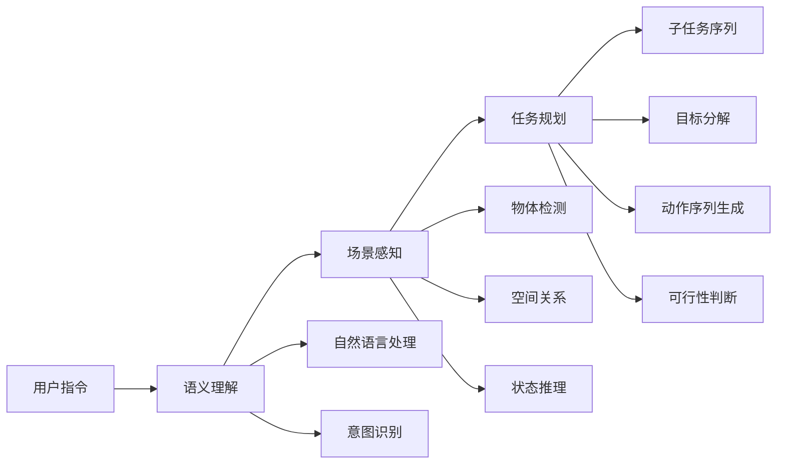

### 2.2.2 关键技术组件

| 组件 | 功能描述 | 技术实现 |
|------|---------|---------|
| **视觉语言模型（VLM）** | 理解图像内容与语言指令的关联 | GPT-4V, Gemini Vision |
| **视觉语言动作模型（VLA）** | 端到端：输入图像+指令，输出动作 | RT-2, OpenVLA, π0 |
| **思维链规划（CoT）** | 将复杂任务分解为子任务序列 | SayCan, VoxPoser |
| **世界模型** | 物理世界建模，预测动作后果 | Video Prediction Models |

### 2.2.3 典型处理流程示例

**用户指令**："把快过期的牛奶扔掉"

```
大脑层处理流程：
1. 语义理解：识别"快过期的牛奶"→需要查看保质期；"扔掉"→放入垃圾桶
2. 场景感知：定位冰箱位置、识别冰箱内牛奶、读取日期标签
3. 任务规划：
   - 导航至冰箱
   - 打开冰箱门
   - 检查每瓶牛奶的保质期
   - 识别即将过期的牛奶
   - 抓取目标牛奶
   - 关闭冰箱门
   - 导航至垃圾桶
   - 投放牛奶
4. 输出：子任务序列 → 传递至小脑层执行
```

---

## 2.3 小脑层（Control）：运动控制

小脑层负责将抽象任务转化为安全、流畅、精准的物理动作，解决"手眼协调"和"接触物理"问题。

### 2.3.1 核心技术路线

| 技术路线 | 核心原理 | 适用场景 | 代表算法 |
|---------|---------|---------|---------|
| **模仿学习（IL）** | 从人类演示数据中学习动作策略 | 精细操作（抓取、放置） | Diffusion Policy, ACT |
| **强化学习（RL）** | 通过试错和奖励信号优化策略 | 动态平衡（行走、跳跃） | PPO, SAC |
| **混合控制** | IL+RL结合，兼顾泛化与精度 | 复杂长序列任务 | 分层架构 |

### 2.3.2 控制频率要求

```
┌────────────────────────────────────────────────────────────────┐
│                    控制频率分层架构                              │
├────────────────────────────────────────────────────────────────┤
│  高层规划（大脑层）    │    1-10 Hz    │  任务级别决策           │
│  中层控制（小脑层）    │   50-100 Hz   │  轨迹规划与调整         │
│  底层伺服（实体层）    │  500-1000 Hz  │  关节级别控制           │
└────────────────────────────────────────────────────────────────┘
```

### 2.3.3 全身协调控制（WBC）

对于人形机器人，需要实现躯干、双臂、双腿的协调运动：

- **目标**：在移动过程中保持平衡，同时完成操作任务
- **挑战**：高自由度（100+关节）、实时性要求高、接触力学复杂
- **代表方案**：WB-VIMA（李飞飞团队）、MPC模型预测控制

---

## 2.4 实体层（Body）：硬件本体

实体层是智能的物理载体，其形态和感知能力直接决定了机器人的应用边界。

### 2.4.1 形态分类对比

| 形态类型 | 结构特征 | 优势 | 局限 | 落地阶段 |
|---------|---------|------|------|---------|
| **轮式移动操作平台** | 轮式底盘+升降腰+双臂 | 效率高、成本可控、可靠性好 | 无法通过楼梯等障碍 | **当前最优解** |
| **轮足复合平台** | 轮腿融合设计 | 兼顾效率与通过性 | 控制复杂度高 | 实验验证中 |
| **四足机器人** | 四条腿+可选机械臂 | 地形适应性强 | 操作能力受限 | 特定场景落地 |
| **人形机器人** | 双足+双臂+灵巧手 | 最适配人类环境 | 成本高、平衡难 | **长期终极目标** |

### 2.4.2 核心硬件模块

```
┌─────────────────────────────────────────────────────────────────┐
│                    实体层硬件模块组成                             │
├─────────────────────────────────────────────────────────────────┤
│  感知模块                                                        │
│  ├── 视觉感知：RGB-D相机（RealSense）、双目/多目相机              │
│  ├── 触觉感知：视触觉传感器（GelSight）、力矩传感器               │
│  ├── 空间定位：LiDAR、视觉SLAM                                   │
│  └── 环境感知：IMU、温湿度、气体传感器                           │
├─────────────────────────────────────────────────────────────────┤
│  执行模块                                                        │
│  ├── 移动底盘：麦克纳姆轮/差速轮/腿足结构                         │
│  ├── 机械臂：6-7自由度协作臂                                     │
│  ├── 末端执行器：平行夹爪/灵巧手（5指16+自由度）                  │
│  └── 一体化关节：电机+减速器+编码器+驱动器                        │
├─────────────────────────────────────────────────────────────────┤
│  计算模块                                                        │
│  ├── 边缘计算：NVIDIA Orin、Qualcomm NPU                        │
│  ├── 云端协同：大模型推理、复杂规划                               │
│  └── 通信模块：WiFi 6/5G、蓝牙、Zigbee                           │
└─────────────────────────────────────────────────────────────────┘
```

---

## 2.5 数据层（Data）：数据基建

数据层是具身智能迭代的核心燃料，也是当前发展最大的瓶颈所在。

### 2.5.1 数据来源三通道

| 数据来源 | 获取方式 | 特点 | 成本 |
|---------|---------|------|------|
| **遥操作采集** | VR/动捕设备，人类远程操控 | 质量高、标注准确 | 高 |
| **仿真合成** | 物理引擎生成海量数据 | 规模大、多样性强 | 低 |
| **真机回流** | 已部署机器人收集数据 | 真实场景、持续增长 | 边际成本低 |

### 2.5.2 数据飞轮机制

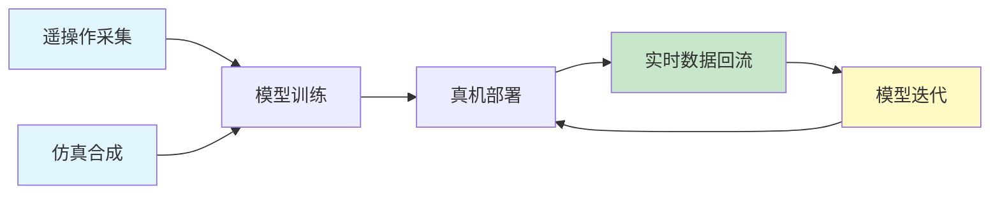

### 2.5.3 数据安全架构

- **边缘计算优先**：敏感数据（图像、语音）在本地处理，不上传云端
- **联邦学习**：多机器人协同学习，模型参数共享但数据不共享
- **隐私保护**：家庭核心隐私数据加密存储，用户可控授权

---

## 2.6 安全与伦理框架

安全与伦理是机器人进入家庭的底线，需要贯穿系统设计始终。

### 2.6.1 安全分层体系

| 安全层级 | 核心要求 | 实现方式 |
|---------|---------|---------|
| **物理安全** | 防止碰撞伤人 | 碰撞检测<10ms响应、力反馈精度0.1N |
| **功能安全** | 异常状态安全停止 | 冗余传感器、故障自检、安全急停 |
| **数据安全** | 保护隐私信息 | 本地处理、加密存储、授权机制 |
| **行为安全** | 符合伦理准则 | 行为约束规则、不承诺无法实现的事 |
| **应急安全** | 断电/断网可用 | 本地应急模式，基础功能持续4小时 |

### 2.6.2 伦理设计原则

1. **透明性**：明确告知用户数据采集范围和使用方式
2. **可控性**：用户随时可终止机器人行为
3. **公平性**：服务所有家庭成员，不产生歧视
4. **责任明确**：建立事故责任认定机制

---

> **本章小结**：四层架构设计实现了"感知-决策-执行-学习"的完整闭环。大脑层提供认知能力，小脑层保障动作精度，实体层构建物理载体，数据层驱动能力迭代。安全与伦理框架作为底座，确保机器人可信、可靠、可控。

---

# 03_核心技术路线详解.md

# 第三章：核心技术路线详解

## 3.1 大脑层关键技术

### 3.1.1 视觉-语言-动作（VLA）模型

VLA（Vision-Language-Action）模型是当前具身智能的核心驱动技术，将视觉感知、语言理解和动作生成统一在一个框架内，实现端到端的"看-懂-做"闭环。

#### 技术原理

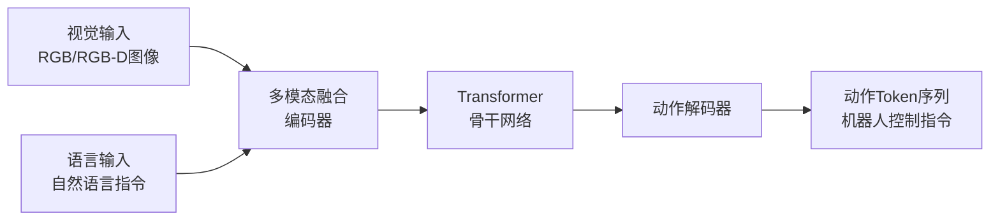

#### 代表性VLA模型对比（2024-2025）

| 模型名称 | 发布方 | 参数量 | 核心特点 | 开源状态 |
|---------|--------|--------|---------|---------|
| **RT-2** | Google DeepMind | 55B | 首个将动作离散化为文本Token，实现知识迁移 | 闭源 |
| **OpenVLA** | 斯坦福+UC Berkeley | 7B | 首个完全开源商用VLA，性能超RT-2-X 16.5% | ✅开源 |
| **π0** | Physical Intelligence | - | 双模块架构，端到端控制，2025年2月开源 | ✅开源 |
| **Helix** | Figure AI | - | 双系统架构（快思考S1+慢思考S2），兼顾效率与泛化 | 闭源 |
| **GR00T N1** | NVIDIA | - | 首个开源可定制通用人形机器人模型，双系统架构 | ✅开源 |
| **X-VLA** | 清华大学 | 0.9B | Soft-Prompt机制，0.9B参数实现120分钟无辅助叠衣 | ✅开源 |
| **Gemini Robotics** | Google DeepMind | - | 强调机器人推理与空间理解，为Gemini 2.0系列 | 闭源 |

#### VLA技术演进趋势

1. **从单一模型到双系统架构**：
   - **System 1（快思考）**：低延迟动作生成，用于实时响应
   - **System 2（慢思考）**：深度推理规划，处理复杂任务

2. **从闭源到开源**：OpenVLA、π0、GR00T N1的开源降低了技术门槛

3. **轻量化趋势**：X-VLA仅0.9B参数，可在边缘设备部署

#### VLA核心能力

```
┌────────────────────────────────────────────────────────────────────────┐
│                        VLA模型核心能力矩阵                              │
├────────────────────────────────────────────────────────────────────────┤
│  语义泛化：理解训练数据中未出现的指令（如"把快过期的苹果扔掉"）           │
│  物体泛化：操作未见过的物体类别（Open Vocabulary）                      │
│  场景适应：适应不同家庭布局和光照条件                                   │
│  推理能力：思维链推理，判断"哪个物体可作为临时锤子"                      │
│  长序列规划：分解复杂任务为可执行的子任务序列                           │
└────────────────────────────────────────────────────────────────────────┘
```

---

### 3.1.2 思维链规划（CoT Planning）

思维链规划利用大语言模型将复杂任务分解为可执行的子任务序列，再调用底层技能库完成执行。

#### 技术架构

```mermaid
graph TD
    A[用户指令<br/>"整理客厅"] --> B[LLM任务分解]
    B --> C[子任务序列]
    C --> D1[拾取地上物品]
    C --> D2[归位沙发靠垫]
    C --> D3[整理茶几物品]
    C --> D4[吸尘清洁地面]
    
    D1 --> E[技能库调用]
    D2 --> E
    D3 --> E
    D4 --> E
    
    E --> F[技能执行<br/>Diffusion Policy]
```

#### 代表方案

| 方案名称 | 核心思路 | 特点 |
|---------|---------|------|
| **SayCan** | 结合语言理解与动作可行性判断 | 先判断"能不能做"，再决定"做什么" |
| **VoxPoser** | LLM生成3D值图引导运动规划 | 将语言指令转化为空间约束 |
| **Code as Policies** | LLM直接生成机器人控制代码 | 利用代码的精确性和可执行性 |

#### 分层规划 vs 端到端

| 技术路径 | 核心思路 | 优势 | 挑战 |
|---------|---------|------|------|
| **分层规划** | 感知→推理→规划→控制模块解耦 | 工程可控，易调试 | 模块间信息损耗 |
| **端到端生成** | 统一模型直接从感知到动作 | 信息融合充分 | 可解释性弱，训练难度大 |

**当前趋势**：采用**混合架构**，高层用LLM做任务分解，底层用端到端VLA执行具体技能。

---

### 3.1.3 世界模型与数字孪生

世界模型使机器人能够在"大脑中预演"动作后果，预测物理世界的变化规律。

#### 核心能力

1. **物理推理**：预测物体运动轨迹、碰撞结果
2. **因果理解**：理解动作与结果的因果关系
3. **场景预测**：预测动作执行后的场景变化
4. **风险评估**：提前识别可能的安全风险

#### 技术路线

| 方向 | 技术方案 | 预期成熟时间 |
|------|---------|-------------|
| 视频预测模型 | Sora类生成模型预测未来帧 | 2026-2027 |
| 物理仿真 | 可微分物理引擎 | 2025-2026 |
| 家庭数字孪生 | 高精度3D家庭环境重建 | 2027-2028 |

#### 发展预测

> 预计在2026-2027年，世界模型将实现物理对齐，机器人能够准确预测"如果我这样做，会发生什么"，进一步推动通用具身智能的发展。

---

## 3.2 小脑层关键技术

### 3.2.1 扩散策略（Diffusion Policy）

扩散策略是当前操作（Manipulation）领域的SOTA技术，将图像生成领域的扩散模型应用于动作序列生成。

#### 技术原理

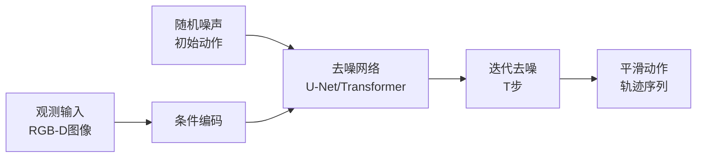

#### 核心优势

1. **多模态动作分布**：同一任务可能有多种正确做法，扩散策略能学习并生成多样化轨迹
2. **抗干扰性强**：去噪过程天然具备鲁棒性
3. **轨迹平滑**：生成的动作序列连续平滑，适合机器人执行
4. **高精度控制**：适合精细操作任务

#### 代表项目

| 项目名称 | 开发方 | 特点 |
|---------|--------|------|
| **Mobile ALOHA** | 斯坦福大学 | 低成本双臂遥操作+Diffusion Policy，开源方案 |
| **ACT** | 斯坦福大学 | Action Chunking with Transformers，长序列任务 |
| **DP3** | MIT | 3D扩散策略，结合点云输入 |

#### 技术参数要求

| 指标 | 目标值 | 说明 |
|------|--------|------|
| 推理频率 | ≥50 Hz | 满足实时控制需求 |
| 轨迹预测长度 | 16-64帧 | 动作分块规划 |
| 去噪步数 | 10-50步 | 平衡精度与速度 |

---

### 3.2.2 强化学习与Sim2Real

强化学习主要用于运动控制（Locomotion），通过仿真训练实现行走、跑跳等动态平衡任务。

#### Sim2Real技术流程

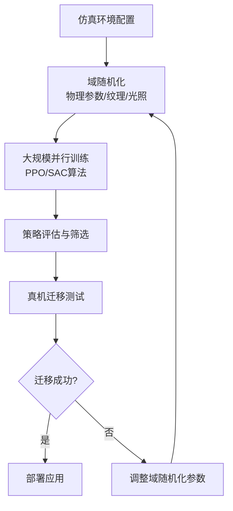

#### 域随机化技术

| 随机化维度 | 具体参数 | 目的 |
|-----------|---------|------|
| **物理参数** | 摩擦系数、质量、关节阻尼 | 应对真实物理差异 |
| **视觉参数** | 光照、纹理、颜色、背景 | 提升视觉模型鲁棒性 |
| **动力学参数** | 电机响应延迟、传感器噪声 | 模拟硬件不确定性 |
| **几何参数** | 物体尺寸、形状变化 | 应对物体多样性 |

#### 代表成果

- **BeyondMimic框架**（北京通用人工智能研究院）：
  - 高保真模仿人类跳跃、侧手翻等高动态动作
  - 引导扩散机制实现零样本任务适应
  - 支持根据简单指令导航避障

---

### 3.2.3 全身协调控制（WBC）

全身协调控制解决人形机器人在移动中完成操作任务的问题。

#### 核心挑战

```
┌────────────────────────────────────────────────────────────────────────┐
│                    全身协调控制关键挑战                                 │
├────────────────────────────────────────────────────────────────────────┤
│  高自由度：人形机器人100+关节，状态空间维度爆炸                         │
│  多任务约束：同时满足平衡、避障、操作等多目标                           │
│  接触力学：与环境接触时的力平衡与柔顺控制                               │
│  实时性：控制周期<10ms，计算资源受限                                   │
└────────────────────────────────────────────────────────────────────────┘
```

#### 技术方案

| 方案 | 原理 | 特点 |
|------|------|------|
| **WBC框架** | 基于二次规划求解多约束优化 | 理论严谨，约束显式建模 |
| **MPC** | 模型预测控制，滚动优化未来轨迹 | 预见性强，处理约束能力好 |
| **学习方法** | 端到端学习全身控制策略 | 适应非线性，泛化能力强 |

#### 代表方案

- **WB-VIMA**（李飞飞团队）：
  - 低成本全身遥操作（JoyLo）
  - 协同学习算法实现"边走边操作"
  - 开源框架降低研究门槛

---

## 3.3 实体层关键技术

### 3.3.1 硬件形态演进

#### 演进路线图

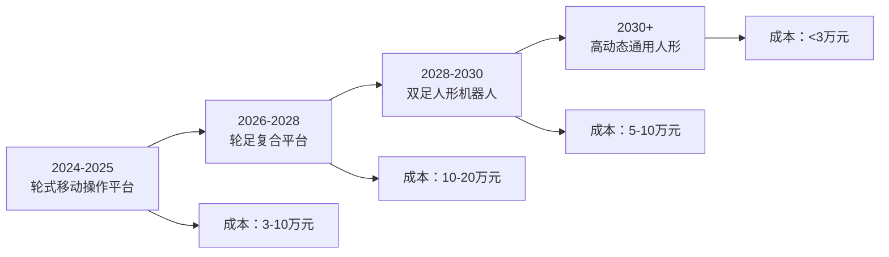

#### 形态对比分析

| 维度 | 轮式平台 | 轮足复合 | 双足人形 |
|------|---------|---------|---------|
| **移动效率** | ★★★★★ | ★★★★ | ★★★ |
| **地形适应** | ★★ | ★★★★ | ★★★★★ |
| **操作能力** | ★★★★ | ★★★★ | ★★★★★ |
| **能耗效率** | ★★★★★ | ★★★★ | ★★★ |
| **成本控制** | ★★★★★ | ★★★ | ★★ |
| **落地成熟度** | ★★★★★ | ★★★ | ★★ |

#### 代表产品

| 产品 | 公司 | 形态 | 特点 |
|------|------|------|------|
| **Galbot** | 银河通用 | 轮式双臂 | TrackVLA端到端导航，零样本适应 |
| **Mobile ALOHA** | 斯坦福 | 轮式双臂 | 低成本开源方案，Diffusion Policy |
| **Figure 02/03** | Figure AI | 人形双足 | 家庭场景优化，织物泡沫材料提升安全 |
| **Optimus** | Tesla | 人形双足 | 预计售价3万美元，2025年量产1万台 |
| **G1** | 宇树科技 | 人形双足 | 灵活经济，43自由度，三指灵巧手 |

---

### 3.3.2 感知系统

#### 多模态感知融合

```
┌────────────────────────────────────────────────────────────────────────┐
│                        多模态感知系统架构                               │
├────────────────────────────────────────────────────────────────────────┤
│                                                                        │
│    ┌─────────┐   ┌─────────┐   ┌─────────┐   ┌─────────┐             │
│    │  视觉   │   │  触觉   │   │  力觉   │   │  本体   │             │
│    │ RGB-D  │   │GelSight │   │力矩传感 │   │  IMU   │             │
│    └────┬────┘   └────┬────┘   └────┬────┘   └────┬────┘             │
│         │             │             │             │                   │
│         └──────────┬──┴─────────────┴──────────┬──┘                   │
│                    │                           │                       │
│              ┌─────▼─────┐               ┌─────▼─────┐                │
│              │ 特征提取  │               │ 状态估计  │                │
│              └─────┬─────┘               └─────┬─────┘                │
│                    │                           │                       │
│              ┌─────▼───────────────────────────▼─────┐                │
│              │         多模态融合与理解层             │                │
│              └───────────────────────────────────────┘                │
└────────────────────────────────────────────────────────────────────────┘
```

#### 3D空间感知

传统2D视觉已无法满足家庭机器人需求，**3D空间智能**成为关键：

| 技术方案 | 功能 | 代表产品 |
|---------|------|---------|
| **空间记忆模组** | 长期环境认知与精准导航 | Odin1（留形科技） |
| **视觉SLAM** | 自主建图与定位 | ORB-SLAM3, LIO-SAM |
| **神经场景表示** | 高保真场景重建 | NeRF, 3D Gaussian Splatting |

---

### 3.3.3 灵巧手与触觉技术

灵巧手是实现精细操作的关键，但也是成本和可靠性的主要瓶颈。

#### 灵巧手发展路线

| 阶段 | 时间 | 形态 | 自由度 | 成本目标 |
|------|------|------|--------|---------|
| 第一阶段 | 2024-2025 | 平行夹爪 | 1-2 | <1000元 |
| 第二阶段 | 2026-2027 | 简化灵巧手 | 6-10 | <5000元 |
| 第三阶段 | 2028-2030 | 仿生灵巧手 | 16-20 | <10000元 |

#### 触觉传感技术

| 技术类型 | 原理 | 特点 | 代表产品 |
|---------|------|------|---------|
| **视触觉** | 相机观察弹性体形变 | 高分辨率，力+形状信息 | GelSight |
| **电子皮肤** | 柔性压阻/电容传感器 | 大面积覆盖，成本较高 | 各类研究原型 |
| **力矩传感** | 关节力矩测量 | 精度高，用于力控制 | ATI, OnRobot |

#### 触觉在家庭场景的关键应用

- **易碎品抓取**：鸡蛋、玻璃杯等需精确力控制
- **柔软物体操作**：衣物折叠、食材处理
- **接触判断**：判断抓取成功与否，防滑脱

---

## 3.4 数据层关键技术

### 3.4.1 低成本遥操作采集

遥操作是获取高质量机器人动作数据的主要方式。

#### 主流遥操作方案对比

| 方案 | 设备成本 | 数据质量 | 操作门槛 | 适用场景 |
|------|---------|---------|---------|---------|
| **ALOHA类** | ~2万元 | ★★★★★ | ★★★ | 双臂精细操作 |
| **VR手柄** | ~3000元 | ★★★ | ★★★★★ | 快速原型验证 |
| **动捕设备** | ~10万元 | ★★★★★ | ★★ | 全身动作采集 |
| **Apple Vision Pro** | ~3万元 | ★★★★ | ★★★★ | 手部精细操作 |
| **手持示教器** | ~5000元 | ★★★ | ★★★★ | 工业机械臂 |

#### ALOHA开源方案

```
┌────────────────────────────────────────────────────────────────────────┐
│                    ALOHA遥操作系统架构                                  │
├────────────────────────────────────────────────────────────────────────┤
│                                                                        │
│  ┌─────────────────┐              ┌─────────────────┐                 │
│  │   主手（人操作）  │  ←─同步─→   │  从手（机器人）  │                 │
│  │  低成本机械臂    │              │   执行机械臂    │                 │
│  └─────────────────┘              └─────────────────┘                 │
│           │                                │                          │
│           └────────────┬───────────────────┘                          │
│                        ▼                                              │
│              ┌─────────────────┐                                      │
│              │  数据记录系统    │                                      │
│              │ RGB + 关节状态  │                                      │
│              └─────────────────┘                                      │
│                                                                        │
│  优势：成本低（~2万元）、开源、数据质量高                                │
│  数据格式：[timestamp, image, joint_positions, gripper_state]         │
└────────────────────────────────────────────────────────────────────────┘
```

---

### 3.4.2 仿真合成数据

仿真数据可以低成本生成海量训练样本，是突破数据瓶颈的关键。

#### 主流仿真平台

| 平台 | 开发方 | 特点 | 适用场景 |
|------|--------|------|---------|
| **Isaac Sim** | NVIDIA | GPU加速，高保真渲染 | 工业+家庭全场景 |
| **ManiSkill** | 北大+UC San Diego | 专注操作任务 | 抓取、放置等 |
| **Genesis** | 开源社区 | 可微分物理引擎 | 强化学习研究 |
| **Habitat** | Meta | 室内导航专用 | 家庭导航任务 |

#### 域随机化策略

```python
# 域随机化参数示例
domain_randomization = {
    "visual": {
        "lighting": Uniform(0.2, 1.5),      # 光照强度
        "texture": RandomFromDataset(),      # 随机纹理
        "color_jitter": Normal(0, 0.1),      # 颜色抖动
        "camera_noise": Gaussian(0, 0.02),   # 相机噪声
    },
    "physics": {
        "friction": Uniform(0.3, 1.2),       # 摩擦系数
        "mass_scale": Uniform(0.8, 1.2),     # 质量缩放
        "joint_damping": Uniform(0.5, 2.0),  # 关节阻尼
    },
    "dynamics": {
        "motor_delay": Uniform(0, 20),       # 电机延迟(ms)
        "sensor_noise": Gaussian(0, 0.01),   # 传感器噪声
    }
}
```

---

### 3.4.3 数据飞轮与持续学习

数据飞轮机制实现"采集→训练→部署→回流→迭代"的正向循环。

#### 飞轮机制设计

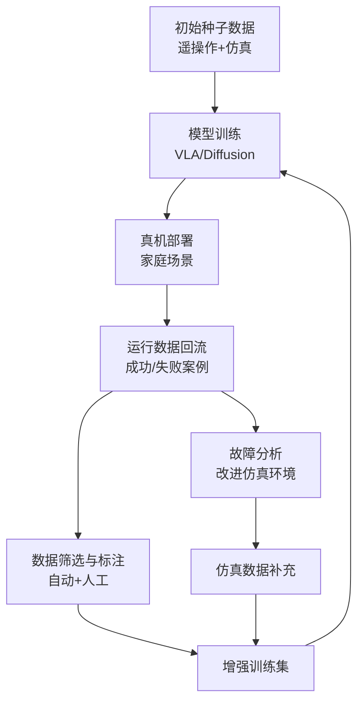

#### 持续学习策略

| 策略 | 描述 | 挑战 |
|------|------|------|
| **在线学习** | 机器人运行时实时更新模型 | 稳定性、灾难性遗忘 |
| **定期微调** | 收集一定量数据后批量更新 | 更新周期选择 |
| **联邦学习** | 多机器人协同学习，数据不共享 | 通信开销、异构性 |
| **主动学习** | 机器人主动请求困难场景的人类示范 | 何时请求、用户体验 |

---

> **本章小结**：核心技术路线涵盖四大层级关键技术。大脑层以VLA模型为核心，结合CoT规划和世界模型实现"理解与规划"；小脑层采用扩散策略和强化学习解决"精准执行"；实体层从轮式平台向人形演进，触觉感知成为关键使能技术；数据层通过遥操作+仿真+数据飞轮构建持续迭代能力。各技术相互配合，共同支撑通用家庭机器人的能力演进。

---

# 04_分阶段发展规划.md

# 第四章：分阶段发展规划

## 总体策略

采用**"垂直切入 → 能力泛化 → 完全通用"**的三步走战略，平衡技术可行性与商业落地需求。

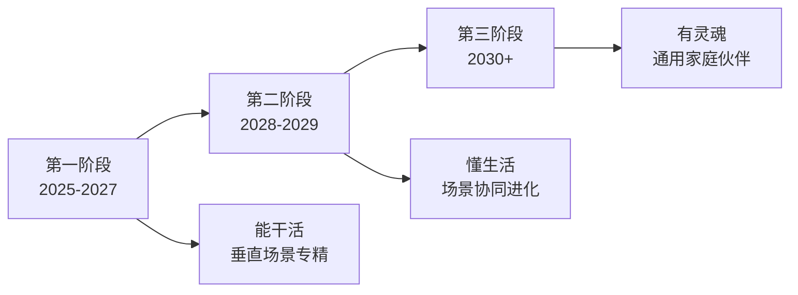

---

## 4.1 第一阶段（2025-2027）：基础能力筑基

### 阶段定位："能干活"

在限定场景内可靠执行特定任务，实现产品化落地。

### 4.1.1 核心目标

| 维度 | 目标描述 | 量化指标 |
|------|---------|---------|
| **导航能力** | 不同户型自主建图与路径规划 | 成功率>98% |
| **物体操作** | 掌握常见家居物品抓取与使用 | 50+物体类别 |
| **交互能力** | 语音+视觉联合理解 | 指令识别准确率>90% |
| **可靠性** | 连续稳定运行 | MTBF>500小时 |

### 4.1.2 硬件配置

```
┌────────────────────────────────────────────────────────────────────────┐
│                    第一阶段硬件配置方案                                 │
├────────────────────────────────────────────────────────────────────────┤
│  形态：轮式底盘 + 升降腰部 + 双臂                                       │
│  底盘：差速驱动/麦克纳姆轮，直径400-600mm                               │
│  机械臂：6自由度 × 2，负载3-5kg/臂                                     │
│  末端执行器：平行夹爪（行程80-120mm）                                   │
│  感知：RGB-D相机 × 2（头部+手腕），2D LiDAR                            │
│  计算：NVIDIA Orin NX/AGX（边缘计算）                                  │
│  成本目标：整机 < 5万元                                                │
└────────────────────────────────────────────────────────────────────────┘
```

### 4.1.3 算法重点

| 能力 | 技术方案 | 数据需求 |
|------|---------|---------|
| **动作执行** | Diffusion Policy（端到端模仿学习） | 每任务500-2000条演示 |
| **语义理解** | 开源VLA模型微调（X-VLA/OpenVLA） | 通用预训练+场景微调 |
| **导航定位** | 视觉SLAM + 语义地图 | 家庭场景3D数据集 |
| **任务规划** | LLM-Agent技能库调用 | 任务分解模板 |

### 4.1.4 典型产品形态

| 产品类型 | 功能定位 | 目标用户 |
|---------|---------|---------|
| **清洁辅助机器人** | 拾取杂物、整理物品、配合扫地机 | 家庭用户 |
| **老人安全监护机器人** | 跌倒检测、紧急呼叫、用药提醒 | 养老机构、居家养老 |
| **物品递送机器人** | 定点取物、室内递送 | 办公室、高端住宅 |

### 4.1.5 数据支撑

- **遥操作采集**：每个任务类型500-2000条高质量演示
- **仿真预训练**：百万级仿真数据，覆盖多种室内环境
- **域随机化**：光照、纹理、物体位置、背景随机化

---

## 4.2 第二阶段（2028-2029）：场景协同进化

### 阶段定位："懂生活"

具备多任务协同与初步个性化适应能力，理解家庭场景规律。

### 4.2.1 核心目标

| 维度 | 目标描述 | 量化指标 |
|------|---------|---------|
| **多任务协同** | 同时处理多个家庭任务 | 3-5个任务并行 |
| **个性化适应** | 学习家庭专属行为模式 | 3-6个月适应期 |
| **开放词汇** | 操作未见过的物体 | 准确率>80% |
| **场景预判** | 预测用户需求，主动服务 | 准确率>70% |

### 4.2.2 硬件升级

```
┌────────────────────────────────────────────────────────────────────────┐
│                    第二阶段硬件升级方案                                 │
├────────────────────────────────────────────────────────────────────────┤
│  新增/升级：                                                           │
│  ├── 灵巧手：16自由度仿生手（成本<5000元/只）                          │
│  ├── 触觉传感：指尖视触觉传感器（GelSight类）                          │
│  ├── 触觉皮肤：手掌区覆盖（100+传感点）                                │
│  ├── 算力升级：云边协同架构（延迟<50ms）                               │
│  └── 续航提升：8小时+连续工作，自动充电                                │
│                                                                        │
│  身高配置：1.2-1.5米（适应家庭操作高度）                                │
│  成本目标：整机 < 8万元                                                │
└────────────────────────────────────────────────────────────────────────┘
```

### 4.2.3 算法突破

| 能力 | 技术方案 | 关键突破 |
|------|---------|---------|
| **世界模型** | 家庭场景数字孪生 | 物理推理准确率>85% |
| **VLA升级** | 端到端VLA模型实用化 | 泛化能力提升 |
| **持续学习** | 在线适应+隐私保护 | 不遗忘已有能力 |
| **情感交互** | 多模态情感识别 | 识别并回应情绪 |

### 4.2.4 典型产品形态

| 产品类型 | 功能定位 | 核心能力 |
|---------|---------|---------|
| **全屋服务机器人** | 家务协助、物品管理、环境调节 | 多房间协同、连续任务 |
| **儿童成长陪伴机器人** | 教育互动、安全守护、习惯培养 | 个性化陪伴、情感交互 |
| **烹饪辅助机器人** | 食材准备、厨具操作、烹饪监控 | 精细操作、安全控制 |

### 4.2.5 典型任务场景

```
场景示例：周三傍晚的家庭服务

[17:30] 根据天气预报自动调节室温和空气净化器
[17:45] 根据冰箱食材和家庭成员喜好，建议晚餐菜单
[18:00] 辅导孩子完成数学作业（语音+屏幕互动）
[18:30] 用户到家前5分钟，准备拖鞋、开启客厅灯光
[18:35] 递上准备好的饮品，告知今日家庭情况摘要
[19:00] 协助准备晚餐食材（洗菜、切配简单食材）
[20:00] 整理餐具至洗碗机，清理餐桌
```

---

## 4.3 第三阶段（2030+）：通用家庭伙伴

### 阶段定位："有灵魂"

高度自主、具备常识推理与深度情感交互能力，成为家庭成员。

### 4.3.1 核心目标

| 维度 | 目标描述 | 量化指标 |
|------|---------|---------|
| **因果推理** | 理解"为何做"而非仅"做什么" | 因果推理准确率>90% |
| **全身协调** | 100+自由度协调运动 | 行走-抓取-表达一体化 |
| **情感连接** | 被视为"家人"而非工具 | 用户满意度>95% |
| **自主学习** | 通过观察学习新技能 | 零样本/少样本学习 |

### 4.3.2 终极形态

```
┌────────────────────────────────────────────────────────────────────────┐
│                    第三阶段终极形态规格                                 │
├────────────────────────────────────────────────────────────────────────┤
│  外观形态：人形机器人                                                   │
│  身高体重：1.6-1.7米，<50kg                                            │
│  自由度：100+关节自由度                                                │
│  灵巧手：20自由度仿生手 × 2，触觉皮肤全覆盖                             │
│  触觉密度：1000+传感点/平方米                                          │
│  续航能力：24小时+（自动充电）                                         │
│  售价目标：<3万元（接近高端家电价格区间）                               │
│  能效比：接近人类1/10水平                                              │
└────────────────────────────────────────────────────────────────────────┘
```

### 4.3.3 关键能力

| 能力 | 描述 | 技术依托 |
|------|------|---------|
| **因果理解** | 理解任务背后的目的（如：整理厨房是为准备晚餐） | 因果推理模型 |
| **工具使用** | 使用刀具、吸尘器、烹饪器具等人类工具 | 通用操作策略 |
| **视频学习** | 通过观看人类视频学习新技能 | 视频到动作模型 |
| **代际传承** | 记录家族故事，向新一代讲述家庭历史 | 长期记忆系统 |
| **情感陪伴** | 识别情绪，在适当时候安慰或鼓励 | 多模态情感交互 |

### 4.3.4 社会影响

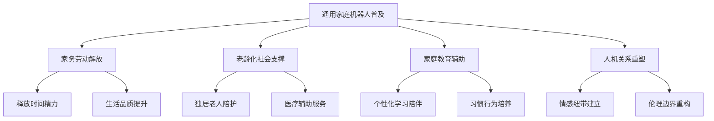

---

## 阶段对比总结

| 维度 | 第一阶段（2025-2027） | 第二阶段（2028-2029） | 第三阶段（2030+） |
|------|---------------------|---------------------|------------------|
| **定位** | "能干活" | "懂生活" | "有灵魂" |
| **形态** | 轮式双臂机器人 | 复合移动操作平台 | 高动态人形机器人 |
| **核心能力** | 特定任务执行 | 多任务协同+个性化 | 通用能力+情感连接 |
| **交互方式** | 语音指令执行 | 主动服务+情境理解 | 情感陪伴+代际传承 |
| **智能水平** | 任务级智能 | 场景级智能 | 通用智能 |
| **成本目标** | <5万元 | <8万元 | <3万元 |
| **渗透率预期** | <5% | 10-20% | >30% |

---

## 关键里程碑时间线

```
2025  ────────────────────────────────────────────────────────────────►
      │
      ├─ Q1: 低成本遥操作数据采集平台成熟
      ├─ Q2: OpenVLA/X-VLA开源模型适配完成
      ├─ Q3: 首批清洁辅助机器人小规模试点
      ├─ Q4: 老人监护机器人养老机构部署

2026  ────────────────────────────────────────────────────────────────►
      │
      ├─ Q1: 低成本肌腱驱动灵巧手原型（成本降至1/5）
      ├─ Q2: Sim2Real技术成熟，仿真到真机迁移成功率>80%
      ├─ Q3: 家庭场景数据集规模化构建
      ├─ Q4: 轮式机器人进入高端家庭市场

2027  ────────────────────────────────────────────────────────────────►
      │
      ├─ Q1: 仿生关节（功耗降低50%，精度提升3倍）
      ├─ Q2: 边缘-云协同架构商用
      ├─ Q3: 第一阶段产品累计销量10万+
      ├─ Q4: 世界模型初步成熟（物理推理准确率>75%）

2028  ────────────────────────────────────────────────────────────────►
      │
      ├─ Q1: 触觉皮肤全覆盖方案成本可控
      ├─ Q2: 端到端VLA模型实用化
      ├─ Q3: 全屋服务机器人进入市场
      ├─ Q4: 个性化适应能力验证

2029  ────────────────────────────────────────────────────────────────►
      │
      ├─ Q1: 多任务协同调度成熟
      ├─ Q2: 儿童陪伴机器人商用
      ├─ Q3: 具身世界模型（物理推理准确率>85%）
      ├─ Q4: 第二阶段渗透率达10%

2030+ ────────────────────────────────────────────────────────────────►
      │
      ├─ 高可靠性人形机器人成本降至3万元
      ├─ 全身协同控制成熟
      ├─ 通用家庭伙伴进入普通家庭
      ├─ 能源效率革命
```

---

> **本章小结**：三阶段发展规划遵循"从专用到通用、从工具到伙伴"的渐进式路径。第一阶段聚焦可落地的垂直场景，验证核心技术；第二阶段扩展场景覆盖，实现个性化服务；第三阶段追求通用能力和情感连接，成为真正的家庭成员。各阶段明确的目标、硬件配置和技术突破点，为研发团队提供清晰的路线指引。

---

# 05_产业实践与技术路线对比.md

# 第五章：产业实践与技术路线对比

## 5.1 三大主流技术路线对比

当前行业尚处早期阶段，核心发展思路为"分阶段、从专用到通用、从简单到复杂"，形成三种主流技术路线并存格局。

### 5.1.1 路线概览

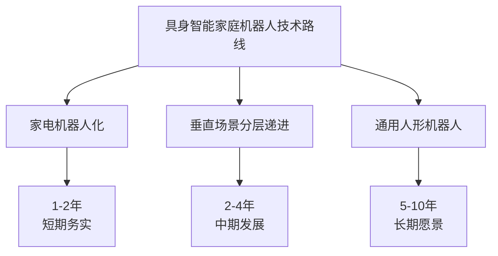

### 5.1.2 详细对比

| 技术路线 | 核心思路 | 代表案例 | 特点与目标 | 发展周期 |
|---------|---------|---------|-----------|---------|
| **家电机器人化** | 将AI与自主决策能力嵌入现有家电，从"被动响应"升级为"主动服务" | 智能空调、进阶版扫地机、主动式厨电 | 路径最务实，成本低、可靠性高，快速规模化 | 1-2年（短期） |
| **垂直场景分层递进** | 从功能受限的专用机器人切入，逐步叠加能力 | 四足陪伴机器人、老人监护机器人、儿童教育机器人 | 平衡可行性与需求，验证关键技术 | 2-4年（中期） |
| **通用人形机器人** | 研发类人形态与高度泛化能力，适配全家庭场景 | Tesla Optimus、Figure 02/03、宇树G1、智元远征系列 | 终极愿景，技术挑战大、成本高 | 5-10年（长期） |

### 5.1.3 路线选择建议

| 目标定位 | 建议路线 | 核心挑战 | 入门参考 |
|---------|---------|---------|---------|
| **快速产品化** | 家电机器人化或垂直专用机器人 | 有限功能内做到极致体验和高可靠性 | 美的主动服务闭环、萤石蓝海大模型 |
| **前沿技术研发** | 通用人形机器人相关VLA、灵巧操作 | 突破算法、硬件与数据的循环依赖 | 李飞飞团队BRS框架开源方案 |
| **投资或战略布局** | 关注垂直场景有深度积累、有渐进式路线图的公司 | 辨别技术成熟度与真实市场需求 | 分析企业场景聚焦度和数据闭环 |

---

## 5.2 国际企业发展动态

### 5.2.1 主要企业布局

| 企业 | 国家 | 产品形态 | 核心技术优势 | 最新动态（2024-2025） |
|------|------|---------|-------------|---------------------|
| **Tesla** | 美国 | Optimus人形机器人 | 端到端神经网络、自研关节、FSD技术迁移 | 预计2025年量产1万台，售价3万美元 |
| **Figure AI** | 美国 | Figure 02/03人形机器人 | Helix VLA双系统架构、与Brookfield合作获取真实场景数据 | 2025年2月发布Helix模型，明确家庭场景方向 |
| **Boston Dynamics** | 美国 | Atlas/Spot | 动态平衡控制、高动态运动能力 | 新版电动Atlas聚焦工业应用 |
| **Google DeepMind** | 美国 | RT-2、Gemini Robotics | VLA模型开创者、强推理能力 | Gemini Robotics强调机器人推理与空间理解 |
| **NVIDIA** | 美国 | GR00T N1 | 首个开源人形机器人模型、Isaac Sim仿真平台 | 2025年3月GTC大会发布，双系统架构 |
| **Physical Intelligence** | 美国 | π0 | 双模块端到端架构 | 2024年10月发布，2025年2月开源 |
| **Agility Robotics** | 美国 | Digit | 独特内弯腿设计、物流仓储优化 | RoboFab工厂年产能1万台 |
| **Unitree（宇树）** | 中国 | G1/H1 | 低成本人形机器人、43自由度、三指灵巧手 | G1售价约2万美元，性价比突出 |

### 5.2.2 技术竞争焦点

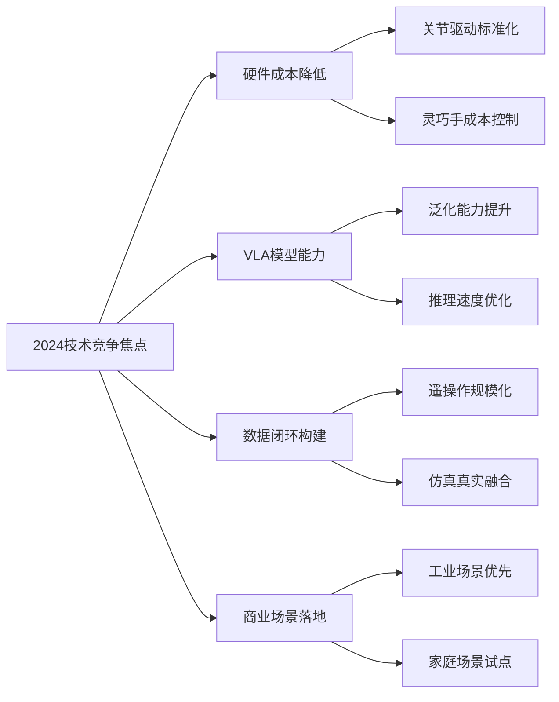

---

## 5.3 中国企业差异化路径

中国企业采用更务实的"场景驱动"路线，结合本土供应链优势和应用场景丰富特点。

### 5.3.1 代表企业与策略

| 企业 | 策略定位 | 核心产品 | 技术特点 |
|------|---------|---------|---------|
| **小米** | 生态整合路线 | 扫地机、门锁、摄像头 → 家庭机器人 | 先单品后整合，IOT生态优势 |
| **宇树科技** | 四足→人形演进 | G1/H1人形机器人 | 四足技术积累，高性价比路线 |
| **智元机器人** | 工业→家庭迁移 | 远征系列 | 工业场景验证后迁移家庭 |
| **银河通用** | 端到端导航 | Galbot轮式机器人 | TrackVLA端到端导航大模型 |
| **傅利叶** | 康复→通用 | GR-3人形机器人 | 康复机器人技术积累 |
| **优必选** | 教育→服务 | Walker S2 | 教育机器人经验迁移 |
| **星动纪元** | 全栈自研 | STAR1 | 全身控制技术 |
| **小鹏汽车** | 汽车→机器人 | Iron | 汽车供应链和AI能力复用 |

### 5.3.2 高校科研力量

| 机构 | 研究方向 | 代表成果 |
|------|---------|---------|
| **清华大学** | 具身智能大模型、VLA | X-VLA（0.9B参数实现长时序任务） |
| **北京大学** | 操作学习、仿真平台 | ManiSkill仿真平台 |
| **上海交通大学** | 机器人控制、灵巧操作 | 多种灵巧操作算法 |
| **北航** | 仿生机器人、小样本学习 | 仿生灵巧手研究 |
| **北京通用人工智能研究院** | 具身智能理论与算法 | BeyondMimic高动态模仿框架 |

### 5.3.3 产业联盟动态

- **2025年**："具身智能"首次写入中国政府工作报告
- **2025年12月**：工信部成立人形机器人与具身智能标准化技术委员会
- **中国移动具身智能产业联盟**：构建"产-学-研-用-测"闭环

---

## 5.4 代表性VLA模型对比

VLA模型是具身智能的核心，2024-2025年涌现出多个代表性模型。

### 5.4.1 模型技术对比

| 模型 | 发布方 | 参数量 | 架构特点 | 主要优势 | 开源 |
|------|--------|--------|---------|---------|------|
| **RT-2** | Google DeepMind | 55B | 动作离散化为文本Token | 开创VLA范式，知识迁移 | ✗ |
| **RT-2-X** | Google DeepMind | 55B | RT-2多机器人扩展版 | 跨平台泛化 | ✗ |
| **OpenVLA** | 斯坦福+UC Berkeley | 7B | Llama2+DINOv2+SigLIP | 开源商用，性能超RT-2-X 16.5% | ✓ |
| **π0** | Physical Intelligence | - | 双模块端到端架构 | 端到端控制 | ✓ |
| **Helix** | Figure AI | - | 快思考S1+慢思考S2双系统 | 兼顾效率与泛化 | ✗ |
| **GR00T N1** | NVIDIA | - | 双系统开源人形模型 | 首个开源可定制人形模型 | ✓ |
| **X-VLA** | 清华大学 | 0.9B | Soft-Prompt机制 | 轻量化，边缘部署 | ✓ |
| **Gemini Robotics** | Google DeepMind | - | Gemini 2.0机器人版 | 强推理能力 | ✗ |
| **SmolVLA** | HuggingFace | - | 轻量级VLA | 低算力部署 | ✓ |

### 5.4.2 架构路线演进

```
2023 ─────────────────────────────────────────────────────────────────►
     │ RT-2发布：证明VLA范式可行
     │ 动作离散化为语言Token

2024 ─────────────────────────────────────────────────────────────────►
     │ OpenVLA开源：VLA民主化
     │ π0发布：端到端控制
     │ 中国VLA模型密集发布

2025 ─────────────────────────────────────────────────────────────────►
     │ 双系统架构成为趋势
     │  - Helix：S1快思考 + S2慢思考
     │  - GR00T N1：双系统开源
     │ 轻量化趋势：X-VLA仅0.9B参数

未来趋势：
     │ ─ 推理效率持续提升
     │ ─ 边缘部署能力增强
     │ ─ 世界模型融合
     │ ─ 持续学习能力
```

### 5.4.3 性能基准对比

| 模型 | SIMPLER基准 | Open-X基准 | 推理延迟 | 适用硬件 |
|------|-------------|-----------|---------|---------|
| RT-2-X | 基准线 | 基准线 | ~500ms | 云端GPU |
| OpenVLA | 基准线+16.5% | 优于RT-2-X | ~200ms | Orin AGX |
| X-VLA | 刷新多项纪录 | - | ~50ms | Orin NX |

### 5.4.4 选型建议

| 场景需求 | 推荐模型 | 理由 |
|---------|---------|------|
| **学术研究** | OpenVLA、X-VLA | 开源、可复现、社区活跃 |
| **快速原型** | SmolVLA | 轻量、易部署 |
| **商用产品** | OpenVLA微调 | 平衡性能与部署成本 |
| **人形机器人** | GR00T N1 | 专为人形设计，开源可定制 |
| **边缘部署** | X-VLA | 0.9B参数，支持实时推理 |

---

## 5.5 关键技术成熟度评估

### 5.5.1 技术就绪等级（TRL）

| 技术领域 | 当前TRL | 2027目标 | 2030目标 | 主要瓶颈 |
|---------|---------|---------|---------|---------|
| VLA语义理解 | TRL 5-6 | TRL 7-8 | TRL 9 | 长尾场景泛化 |
| 扩散策略控制 | TRL 6-7 | TRL 8 | TRL 9 | 实时性优化 |
| 灵巧手操作 | TRL 4-5 | TRL 6-7 | TRL 8 | 成本与可靠性 |
| 全身协调控制 | TRL 4-5 | TRL 6 | TRL 8 | 动态平衡 |
| 触觉感知 | TRL 5-6 | TRL 7 | TRL 8 | 耐久性与成本 |
| 仿真到真机迁移 | TRL 5-6 | TRL 7-8 | TRL 9 | 物理差距缩小 |
| 世界模型 | TRL 3-4 | TRL 5-6 | TRL 7-8 | 物理推理精度 |

### 5.5.2 投资热点分析

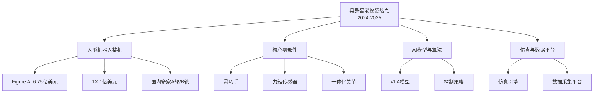

---

> **本章小结**：产业实践呈现三条主流路线并行发展的格局。国际企业在人形机器人和VLA模型方面领先，中国企业通过场景驱动和供应链优势寻求差异化。VLA模型经历了从闭源到开源、从大模型到轻量化的演进，双系统架构成为2025年的技术趋势。企业和研发团队应根据自身定位选择合适的技术路线和模型方案。

---

# 06_关键挑战与破局策略.md

# 第六章：关键挑战与破局策略

具身智能通用家庭机器人的发展面临多维度挑战，需要系统性的破局策略。

---

## 6.1 数据匮乏与质量问题

### 6.1.1 挑战分析

| 问题维度 | 具体表现 | 影响程度 |
|---------|---------|---------|
| **数据稀缺** | 相比NLP万亿Token，机器人高质量动作数据极其稀缺 | ★★★★★ |
| **数据孤岛** | 各企业数据不互通，难以形成规模效应 | ★★★★ |
| **采集成本高** | 遥操作需要专业人员和设备，难以规模化 | ★★★★ |
| **质量参差** | 演示数据包含大量噪声和次优解 | ★★★ |
| **场景长尾** | 家庭场景千差万别，Corner Cases无穷 | ★★★★★ |

### 6.1.2 破局策略

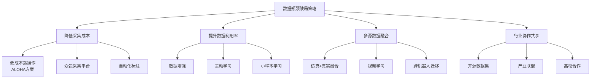

### 6.1.3 具体措施

| 策略 | 实施方案 | 预期效果 |
|------|---------|---------|
| **低成本遥操作** | 推广ALOHA等开源方案，成本<2万元 | 采集成本降低80% |
| **仿真合成** | Isaac Sim+域随机化，生成百万级数据 | 解决规模问题 |
| **行业联盟** | 参与Open X-Embodiment等开源项目 | 数据规模提升10倍+ |
| **思维链数据** | 构建类似VLA-CoT的推理步骤数据集 | 提升复杂任务泛化 |

---

## 6.2 推理延迟与实时性矛盾

### 6.2.1 挑战分析

```
┌────────────────────────────────────────────────────────────────────────┐
│                    推理延迟与控制频率的矛盾                             │
├────────────────────────────────────────────────────────────────────────┤
│                                                                        │
│  大模型推理延迟：200-500ms                                             │
│       │                                                                │
│       │←───────────────────────── 矛盾 ─────────────────────────→│     │
│       │                                                                │
│  运动控制要求：100-1000Hz（1-10ms周期）                                │
│                                                                        │
│  问题：大模型无法直接用于实时闭环控制                                   │
└────────────────────────────────────────────────────────────────────────┘
```

### 6.2.2 破局策略

| 策略 | 技术方案 | 适用场景 |
|------|---------|---------|
| **端云协同** | 大模型云端推理，小模型本地控制 | 复杂规划+实时执行 |
| **分层架构** | 高层规划低频，底层控制高频 | 通用方案 |
| **模型轻量化** | 蒸馏、量化、剪枝（如X-VLA 0.9B） | 边缘部署 |
| **预测缓冲** | 预测多步动作，缓冲执行 | 连续轨迹任务 |
| **硬件加速** | NPU/TPU专用加速，NVIDIA Orin | 提升推理速度 |

### 6.2.3 分层架构设计

```
┌──────────────────────────────────────────────────────────────────┐
│                    端云协同分层架构                               │
├──────────────────────────────────────────────────────────────────┤
│                                                                  │
│  ┌─────────────────────────────────────────────────────────┐    │
│  │              云端 / 边缘高算力端                         │    │
│  │  ┌──────────────┐  ┌──────────────┐                    │    │
│  │  │  VLA大模型   │  │  任务规划器   │                    │    │
│  │  │  语义理解    │  │  路径规划    │                    │    │
│  │  └──────────────┘  └──────────────┘                    │    │
│  │           频率：1-10 Hz                                 │    │
│  └────────────────────────┬────────────────────────────────┘    │
│                           │ 子任务/目标点                        │
│  ┌────────────────────────▼────────────────────────────────┐    │
│  │              本地边缘端 (Orin NX/AGX)                    │    │
│  │  ┌──────────────┐  ┌──────────────┐                    │    │
│  │  │ Diffusion    │  │  轨迹优化    │                    │    │
│  │  │ Policy执行   │  │  避障调整    │                    │    │
│  │  └──────────────┘  └──────────────┘                    │    │
│  │           频率：50-100 Hz                               │    │
│  └────────────────────────┬────────────────────────────────┘    │
│                           │ 关节指令                             │
│  ┌────────────────────────▼────────────────────────────────┐    │
│  │              实时控制器 (MCU)                            │    │
│  │  ┌──────────────┐  ┌──────────────┐                    │    │
│  │  │  PID/阻抗    │  │  安全保护    │                    │    │
│  │  │  控制器      │  │  急停响应    │                    │    │
│  │  └──────────────┘  └──────────────┘                    │    │
│  │           频率：500-1000 Hz                             │    │
│  └──────────────────────────────────────────────────────────┘    │
└──────────────────────────────────────────────────────────────────┘
```

---

## 6.3 安全与伦理风险

### 6.3.1 物理安全风险

| 风险类型 | 场景描述 | 后果严重度 |
|---------|---------|-----------|
| **碰撞伤人** | 机器人移动/操作时撞到家庭成员 | ★★★★★ |
| **夹伤** | 灵巧手抓取时夹住人体部位 | ★★★★ |
| **物品损坏** | 操作力度不当导致物品破损 | ★★★ |
| **坠落物** | 抓取失败导致物品坠落砸伤 | ★★★★ |
| **失控** | 软硬件故障导致不可控行为 | ★★★★★ |

### 6.3.2 物理安全破局策略

| 策略 | 技术要求 | 实现方式 |
|------|---------|---------|
| **碰撞检测** | 响应时间<10ms | 力矩传感+电流检测+接近传感 |
| **力反馈控制** | 精度0.1N | 关节力矩传感器+阻抗控制 |
| **柔性设计** | 撞击力衰减>50% | 柔软包覆材料+串联弹性驱动 |
| **限速限力** | 速度<1.5m/s | 安全区域速度限制 |
| **冗余系统** | 单点故障不失控 | 双通道监控+独立安全MCU |

### 6.3.3 数据隐私保护

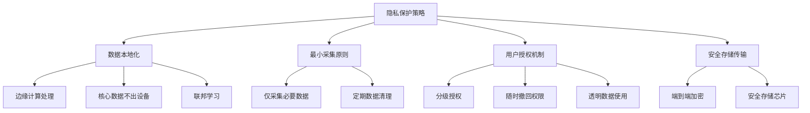

### 6.3.4 伦理行为准则

| 准则 | 描述 | 实现机制 |
|------|------|---------|
| **不欺骗** | 不对用户做虚假承诺 | 能力边界明确告知 |
| **不歧视** | 公平服务所有成员 | 算法公平性审计 |
| **透明性** | 行为可解释可预测 | 动作意图表达 |
| **可控性** | 用户随时可终止 | 物理急停+语音指令 |
| **隐私尊重** | 保护个人隐私 | 见上述隐私策略 |

---

## 6.4 硬件成本与可靠性瓶颈

### 6.4.1 成本构成分析

```
┌────────────────────────────────────────────────────────────────────────┐
│                    人形机器人成本构成（当前）                           │
├────────────────────────────────────────────────────────────────────────┤
│                                                                        │
│  灵巧手（2只）         ████████████████████████████  40%              │
│  一体化关节            ████████████████████          25%              │
│  传感器系统            ████████████                  15%              │
│  计算单元              ██████                        8%               │
│  结构件&其他           ████████                      12%              │
│                                                                        │
│  总成本：约15-30万元（工程样机）                                        │
│  目标成本：<3万元（2030年消费级）                                       │
└────────────────────────────────────────────────────────────────────────┘
```

### 6.4.2 降本路径

| 部件 | 当前成本 | 目标成本 | 降本措施 |
|------|---------|---------|---------|
| **灵巧手** | 2-5万元/只 | <5000元/只 | 简化设计、国产化、规模效应 |
| **一体化关节** | 5000-1万元/个 | <1000元/个 | 标准化、国产减速器 |
| **力矩传感器** | 2000-5000元/个 | <500元/个 | MEMS技术、集成化 |
| **计算单元** | 1-3万元 | <5000元 | 国产NPU、算力优化 |

### 6.4.3 可靠性提升

| 维度 | 当前状态 | 目标要求 | 改进方向 |
|------|---------|---------|---------|
| **MTBF** | ~200小时 | >2000小时 | 关键部件冗余、防护设计 |
| **连续工作** | 4-6小时 | 8-24小时 | 电池技术、自动充电 |
| **故障自诊断** | 基础报错 | 预测性维护 | 状态监控、AI诊断 |
| **维护周期** | 每周检修 | 每月/季度 | 模块化设计、快换 |

---

## 6.5 法规标准缺失

### 6.5.1 现状分析

| 领域 | 标准状态 | 问题影响 |
|------|---------|---------|
| **安全标准** | 无专用标准，参考工业机器人 | 条款不适用家庭场景 |
| **性能评估** | 无统一基准 | 产品难以横向对比 |
| **数据隐私** | 通用法规，无专门规定 | 合规边界不清 |
| **责任认定** | 法规空白 | 事故责任难界定 |
| **伦理规范** | 缺乏行业共识 | 行为边界模糊 |

### 6.5.2 标准化工作进展

- **2025年12月**：工信部成立人形机器人与具身智能标准化技术委员会
- **行业呼吁**：建立家庭机器人安全白皮书

### 6.5.3 预期标准框架

```
┌────────────────────────────────────────────────────────────────────────┐
│                    家庭机器人标准体系框架（预期）                        │
├────────────────────────────────────────────────────────────────────────┤
│                                                                        │
│  ┌────────────────┐  ┌────────────────┐  ┌────────────────┐          │
│  │   安全标准      │  │   性能标准      │  │   互联互通      │          │
│  │                │  │                │  │                │          │
│  │ • 物理安全     │  │ • 操作精度     │  │ • 通信协议     │          │
│  │ • 电气安全     │  │ • 导航能力     │  │ • 数据格式     │          │
│  │ • 功能安全     │  │ • 续航能力     │  │ • 接口规范     │          │
│  │ • 网络安全     │  │ • 可靠性指标   │  │ • 跨平台协作   │          │
│  └────────────────┘  └────────────────┘  └────────────────┘          │
│                                                                        │
│  ┌────────────────┐  ┌────────────────┐  ┌────────────────┐          │
│  │   隐私合规      │  │   伦理规范      │  │   测试认证      │          │
│  │                │  │                │  │                │          │
│  │ • 数据采集     │  │ • 行为准则     │  │ • 检测方法     │          │
│  │ • 存储传输     │  │ • 人机关系     │  │ • 认证流程     │          │
│  │ • 用户权限     │  │ • 责任边界     │  │ • 等级划分     │          │
│  │ • 跨境流动     │  │ • 儿童保护     │  │ • 周期复测     │          │
│  └────────────────┘  └────────────────┘  └────────────────┘          │
└────────────────────────────────────────────────────────────────────────┘
```

---

## 挑战与策略总结

| 挑战 | 核心问题 | 短期策略（1-2年） | 长期策略（3-5年） |
|------|---------|------------------|------------------|
| **数据匮乏** | 高质量数据稀缺 | 低成本遥操作+仿真 | 行业数据共享联盟 |
| **实时性** | 大模型推理慢 | 端云协同分层架构 | 模型轻量化+专用硬件 |
| **安全性** | 伤人风险 | 限速限力+碰撞检测 | 全身柔性设计 |
| **成本** | 硬件价格高 | 功能简化+国产替代 | 规模效应+技术突破 |
| **标准** | 法规空白 | 参与标准制定 | 推动立法完善 |

---

> **本章小结**：通用家庭机器人面临数据、实时性、安全、成本、标准五大核心挑战。每项挑战都需要技术创新与产业协作相结合的系统性解决方案。端云协同架构解决实时性矛盾，分层安全体系保障物理安全，开源协作打破数据孤岛，标准化推动产业健康发展。这些挑战的逐步克服将决定行业的商业化进程。

---

# 07_总结与展望.md

# 第七章：总结与展望

## 7.1 核心结论

### 7.1.1 技术路线总结

具身智能通用家庭机器人代表了AI与机器人融合的最高形态。本文档系统梳理了从技术架构到商业落地的完整路线图：

```
┌────────────────────────────────────────────────────────────────────────┐
│                        技术路线核心要点                                 │
├────────────────────────────────────────────────────────────────────────┤
│                                                                        │
│  ┌─────────────────────────────────────────────────────────────────┐  │
│  │  架构设计：大脑-小脑-实体-数据 四层分层架构                        │  │
│  │  • 大脑层：VLA模型 + 思维链规划                                  │  │
│  │  • 小脑层：扩散策略 + 强化学习                                   │  │
│  │  • 实体层：从轮式平台到人形机器人演进                             │  │
│  │  • 数据层：遥操作 + 仿真 + 数据飞轮                              │  │
│  └─────────────────────────────────────────────────────────────────┘  │
│                                                                        │
│  ┌─────────────────────────────────────────────────────────────────┐  │
│  │  发展阶段：三步走渐进策略                                         │  │
│  │  • 第一阶段（2025-2027）：垂直场景专精，"能干活"                  │  │
│  │  • 第二阶段（2028-2029）：场景协同进化，"懂生活"                  │  │
│  │  • 第三阶段（2030+）：通用家庭伙伴，"有灵魂"                      │  │
│  └─────────────────────────────────────────────────────────────────┘  │
│                                                                        │
│  ┌─────────────────────────────────────────────────────────────────┐  │
│  │  核心挑战：五大瓶颈                                               │  │
│  │  数据匮乏 → 推理延迟 → 安全伦理 → 硬件成本 → 法规标准             │  │
│  └─────────────────────────────────────────────────────────────────┘  │
└────────────────────────────────────────────────────────────────────────┘
```

### 7.1.2 当前最佳切入点

基于技术成熟度和市场需求分析，**当前最具可行性的技术切入点**为：

| 维度 | 推荐方案 | 理由 |
|------|---------|------|
| **硬件形态** | 轮式底盘 + 升降腰部 + 双臂 | 成本可控、可靠性高、可快速落地 |
| **动作控制** | Diffusion Policy（扩散策略） | 当前操作任务SOTA，开源生态完善 |
| **语义理解** | OpenVLA/X-VLA开源模型微调 | 平衡性能与部署成本 |
| **数据采集** | ALOHA低成本遥操作方案 | 成本<2万元，质量有保障 |
| **目标场景** | 厨房/洗衣房半结构化场景 | 需求明确，长尾问题相对可控 |

---

## 7.2 技术切入建议

### 7.2.1 针对不同角色的建议

#### 研发团队

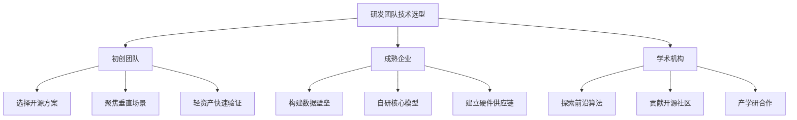

#### 具体建议

| 角色 | 短期重点（1年） | 中期重点（2-3年） | 资源投入建议 |
|------|----------------|------------------|-------------|
| **初创团队** | 选定垂直场景，用开源模型验证MVP | 积累场景数据，迭代产品 | 硬件40% + 算法40% + 数据20% |
| **成熟企业** | 建立数据采集和标注流水线 | 自研VLA模型，构建技术壁垒 | 硬件30% + 算法30% + 数据40% |
| **学术机构** | 探索新算法（世界模型、持续学习） | 发表高质量论文，输送人才 | 算法60% + 实验验证40% |

### 7.2.2 技术选型决策树

```
开始
  │
  ├─ 目标是快速产品化？
  │    ├─ 是 → 选择轮式平台 + 开源VLA
  │    └─ 否 ↓
  │
  ├─ 预算充足？（>1000万元/年）
  │    ├─ 是 → 可考虑人形机器人研发
  │    └─ 否 ↓
  │
  ├─ 有强大的AI团队？
  │    ├─ 是 → 自研VLA模型
  │    └─ 否 → 微调开源模型
  │
  └─ 建议：从单一场景切入，验证后再扩展
```

---

## 7.3 未来展望

### 7.3.1 技术发展预测

| 时间 | 预测事件 | 影响 |
|------|---------|------|
| **2025年** | VLA模型进入实用阶段，开源模型性能接近商用 | 降低技术门槛 |
| **2026年** | 世界模型开始物理对齐 | 机器人预测能力提升 |
| **2027年** | 灵巧手成本降至当前1/5 | 精细操作普及 |
| **2028年** | 人形机器人开始小规模进入家庭 | 市场教育启动 |
| **2030年** | 通用家庭机器人成本降至3万元以下 | 大众市场开启 |

### 7.3.2 2030年家庭生活愿景

> 想象一个2030年普通家庭的周三傍晚：
>
> 你下班回家前，机器人已根据天气预报调节好室温，根据冰箱食材和你今天的会议日程（知道你可能疲惫）准备了一份清淡易消化的晚餐菜单。它辅导了孩子的数学作业，记得爷爷喜欢的茶水温度是65度，知道妈妈对花粉过敏所以调整了今天的清洁计划避免扬尘。
>
> 当你疲惫地推门而入，它递上拖鞋说："今天辛苦了，汤在保温，需要我先放洗澡水吗？小明的数学作业完成了，不过有两道题我建议你和他一起讨论一下。"
>
> 这不是科幻——这是我们正在构建的未来。

### 7.3.3 行业发展建议

1. **技术层面**
   - 持续投入VLA模型和世界模型研发
   - 推动低成本灵巧手和触觉传感器国产化
   - 建立高质量机器人数据集开放共享机制

2. **产业层面**
   - 构建产学研协同创新生态
   - 推动行业标准和法规完善
   - 培养具身智能复合型人才

3. **商业层面**
   - 采用渐进式落地策略，从垂直场景切入
   - 重视用户体验和安全性
   - 建立可持续的商业模式（硬件+服务）

---

## 结语

具身智能通用家庭机器人的技术路线是一场围绕**"感知、认知、控制、数据"**四大支柱的持续攀登。当前行业正处于从"专用"走向"通用"的关键转型期：

- **短期内**：专用机器人广泛落地，通用机器人重点突破
- **中期**：多场景协同，个性化服务成为可能
- **长期**：真正的家庭伙伴进入寻常百姓家

真正的"拐点"并非单项技术的突破，而是**技术成熟度、成本可控性、场景适配性与社会接受度**的系统性跨越。当机器人能够以万元级别的成本，安全、可靠地处理大多数家务时，它将像当年的个人电脑和智能手机一样，开启一个全新的时代。

中国企业凭借丰富的家庭场景、强大的供应链和积极的产业政策，有望在场景化应用和商业化落地上走出差异化道路，为全球具身智能产业发展贡献中国方案。

---

> **文档版本**：2.0  
> **更新日期**：2025年1月  
> **编制说明**：本技术路线图基于截至2025年底的公开资料、产业动态与研究论文分析。鉴于具身智能领域发展日新月异，具体时间节点与路径细节将随技术突破而动态调整。

---

# 08_附录.md

# 附录

## 附录A：关键术语表

| 术语 | 英文全称 | 中文释义 |
|------|---------|---------|
| **VLA** | Vision-Language-Action | 视觉-语言-动作模型，端到端将视觉和语言输入映射为机器人动作 |
| **VLM** | Vision-Language Model | 视觉语言模型，理解图像和文本的关联 |
| **LLM** | Large Language Model | 大语言模型 |
| **CoT** | Chain of Thought | 思维链，一种让模型逐步推理的技术 |
| **Diffusion Policy** | - | 扩散策略，将扩散模型用于动作生成的技术 |
| **IL** | Imitation Learning | 模仿学习，从演示数据中学习策略 |
| **RL** | Reinforcement Learning | 强化学习，通过奖励信号优化策略 |
| **Sim2Real** | Simulation to Reality | 仿真到真机迁移 |
| **WBC** | Whole Body Control | 全身协调控制 |
| **MPC** | Model Predictive Control | 模型预测控制 |
| **SLAM** | Simultaneous Localization and Mapping | 同时定位与建图 |
| **RGB-D** | RGB + Depth | 彩色图像+深度图像 |
| **GelSight** | - | 一种视触觉传感器品牌，可获取接触力和形状信息 |
| **ALOHA** | A Low-cost Open-source Hardware Assembly | 低成本开源双臂遥操作硬件方案 |
| **Isaac Sim** | - | NVIDIA开发的机器人仿真平台 |
| **Domain Randomization** | - | 域随机化，通过随机化仿真参数提升迁移效果 |
| **MTBF** | Mean Time Between Failures | 平均故障间隔时间 |
| **TRL** | Technology Readiness Level | 技术就绪等级 |
| **NPU** | Neural Processing Unit | 神经网络处理单元 |
| **Orin** | - | NVIDIA Jetson系列边缘计算平台 |
| **端到端** | End-to-End | 从输入直接到输出，中间无显式模块划分 |

---

## 附录B：参考资料来源

### B.1 学术论文

| 论文 | 作者/机构 | 主要贡献 |
|------|---------|---------|
| RT-2: Vision-Language-Action Models | Google DeepMind | 开创VLA范式 |
| OpenVLA: An Open-Source Vision-Language-Action Model | Stanford/UC Berkeley | 首个开源商用VLA |
| Diffusion Policy | Columbia/MIT | 将扩散模型用于机器人控制 |
| ACT: Action Chunking with Transformers | Stanford | 长序列动作预测 |
| X-VLA | 清华大学 | 轻量化VLA模型 |
| Mobile ALOHA | Stanford | 低成本双臂遥操作 |
| VoxPoser | Stanford | LLM生成3D值图引导规划 |
| SayCan | Google | 语言理解与动作可行性结合 |

### B.2 行业报告

| 报告 | 发布机构 | 时间 |
|------|---------|------|
| 具身智能发展报告（2024） | 中国信息通信研究院 | 2024年11月 |
| 人形机器人产业发展展望 | IDC | 2024年 |
| 家用智能机器人市场分析 | 智研咨询 | 2024年 |

### B.3 企业技术发布

| 企业 | 发布内容 | 时间 |
|------|---------|------|
| Google DeepMind | Gemini Robotics | 2025年 |
| NVIDIA | GR00T N1 | 2025年3月 |
| Figure AI | Helix双系统架构 | 2025年2月 |
| Physical Intelligence | π0开源 | 2025年2月 |
| Tesla | Optimus量产计划 | 2024-2025年 |

### B.4 开源项目

| 项目 | 链接 | 用途 |
|------|------|------|
| OpenVLA | github.com/openvla | VLA模型训练与部署 |
| Mobile ALOHA | github.com/mobile-aloha | 低成本遥操作 |
| Isaac Sim | developer.nvidia.com | 机器人仿真 |
| ManiSkill | github.com/haosulab/ManiSkill | 操作任务仿真 |

---

## 附录C：技术架构图

### C.1 四层架构总图

```
                    ┌───────────────────────────────┐
                    │         用户与环境            │
                    └───────────────┬───────────────┘
                                    │
        ┌───────────────────────────▼───────────────────────────┐
        │                    大脑层 (Cognition)                  │
        │  ┌────────────┐  ┌────────────┐  ┌────────────┐      │
        │  │ VLA/VLM    │  │ 任务规划   │  │ 世界模型   │      │
        │  │ 语义理解   │  │ CoT分解    │  │ 物理推理   │      │
        │  └────────────┘  └────────────┘  └────────────┘      │
        └───────────────────────────┬───────────────────────────┘
                                    │ 抽象任务
        ┌───────────────────────────▼───────────────────────────┐
        │                    小脑层 (Control)                    │
        │  ┌────────────┐  ┌────────────┐  ┌────────────┐      │
        │  │ Diffusion  │  │ 强化学习   │  │ 全身控制   │      │
        │  │ Policy     │  │ Sim2Real   │  │ WBC/MPC    │      │
        │  └────────────┘  └────────────┘  └────────────┘      │
        └───────────────────────────┬───────────────────────────┘
                                    │ 控制信号
        ┌───────────────────────────▼───────────────────────────┐
        │                    实体层 (Body)                       │
        │  ┌────────────┐  ┌────────────┐  ┌────────────┐      │
        │  │ 视觉/触觉  │  │ 关节执行   │  │ 边缘计算   │      │
        │  │ 多模态感知 │  │ 灵巧手     │  │ Orin/NPU   │      │
        │  └────────────┘  └────────────┘  └────────────┘      │
        └───────────────────────────┬───────────────────────────┘
                                    │ 环境交互
        ┌───────────────────────────▼───────────────────────────┐
        │                    数据层 (Data)                       │
        │  ┌────────────┐  ┌────────────┐  ┌────────────┐      │
        │  │ 遥操作     │  │ 仿真训练   │  │ 数据飞轮   │      │
        │  │ 数据采集   │  │ Isaac Sim  │  │ 持续学习   │      │
        │  └────────────┘  └────────────┘  └────────────┘      │
        └───────────────────────────────────────────────────────┘
```

### C.2 VLA模型数据流

```
输入层                    处理层                     输出层
────────────────────────────────────────────────────────────────

┌─────────────┐      ┌─────────────────────┐      ┌─────────────┐
│  RGB图像    │─────▶│                     │      │ 动作Token   │
│  (640×480)  │      │   多模态编码器      │      │ [dx,dy,dz,  │
└─────────────┘      │   (SigLIP+DINOv2)   │      │  rx,ry,rz,  │
                     │                     │─────▶│  gripper]   │
┌─────────────┐      │         │          │      │             │
│  深度图像   │─────▶│         ▼          │      └─────────────┘
│  (640×480)  │      │   Transformer      │            │
└─────────────┘      │   骨干网络         │            │
                     │   (Llama2-7B)      │            ▼
┌─────────────┐      │         │          │      ┌─────────────┐
│  语言指令   │─────▶│         ▼          │      │  关节控制   │
│  "拿起杯子" │      │   动作解码器       │      │  逆运动学   │
└─────────────┘      └─────────────────────┘      └─────────────┘
```

### C.3 发展阶段路线图

```
2025        2026        2027        2028        2029        2030+
  │           │           │           │           │           │
  ▼           ▼           ▼           ▼           ▼           ▼
┌─────────────────────────────────────────────────────────────────────┐
│                         第一阶段：能干活                             │
│  ├── 轮式双臂机器人商用                                             │
│  ├── Diffusion Policy成熟                                          │
│  ├── 垂直场景（清洁、监护）落地                                      │
│  └── 累计销量10万+                                                  │
└─────────────────────────────────────────────────────────────────────┘
              │
              ▼
        ┌─────────────────────────────────────────────────────────────┐
        │                   第二阶段：懂生活                           │
        │  ├── 低成本灵巧手普及                                       │
        │  ├── 世界模型实用化                                         │
        │  ├── 多任务协同                                             │
        │  └── 个性化适应                                             │
        └─────────────────────────────────────────────────────────────┘
                      │
                      ▼
                ┌─────────────────────────────────────────────────────┐
                │                 第三阶段：有灵魂                     │
                │  ├── 人形机器人成本<3万元                           │
                │  ├── 100+自由度全身协调                             │
                │  ├── 因果推理+情感连接                              │
                │  └── 家庭渗透率>30%                                 │
                └─────────────────────────────────────────────────────┘
```

---

## 附录D：技术指标参考值

### D.1 硬件性能指标

| 指标类别 | 参数 | 第一阶段目标 | 第二阶段目标 | 第三阶段目标 |
|---------|------|-------------|-------------|-------------|
| **移动** | 最大速度 | 1.5 m/s | 2.0 m/s | 2.5 m/s |
| **移动** | 导航成功率 | >98% | >99% | >99.5% |
| **操作** | 负载能力 | 3 kg/臂 | 5 kg/臂 | 10 kg/臂 |
| **操作** | 位置精度 | ±5 mm | ±2 mm | ±1 mm |
| **感知** | 物体识别 | 50+类别 | 200+类别 | 开放词汇 |
| **续航** | 连续工作 | 4小时 | 8小时 | 24小时 |
| **成本** | 整机价格 | <5万元 | <8万元 | <3万元 |

### D.2 算法性能指标

| 指标类别 | 参数 | 第一阶段目标 | 第二阶段目标 | 第三阶段目标 |
|---------|------|-------------|-------------|-------------|
| **语义理解** | 指令识别准确率 | >90% | >95% | >98% |
| **任务执行** | 单任务成功率 | >85% | >92% | >98% |
| **推理延迟** | VLA推理时间 | <200ms | <100ms | <50ms |
| **泛化能力** | 新物体操作成功率 | >60% | >80% | >95% |
| **物理推理** | 世界模型准确率 | - | >75% | >90% |

---

> **附录编制说明**：本附录提供技术术语、参考资料和架构图示，便于读者深入理解文档内容。技术指标为行业参考值，具体实现可能因技术路线和应用场景而异。
