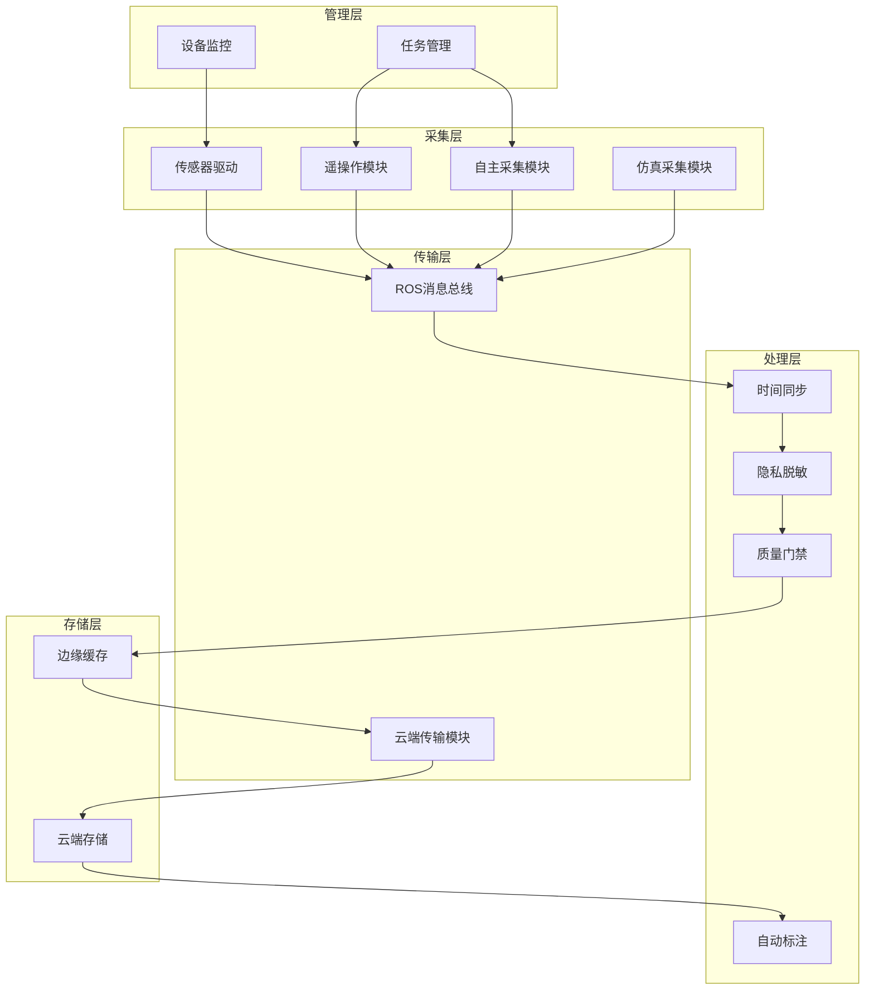
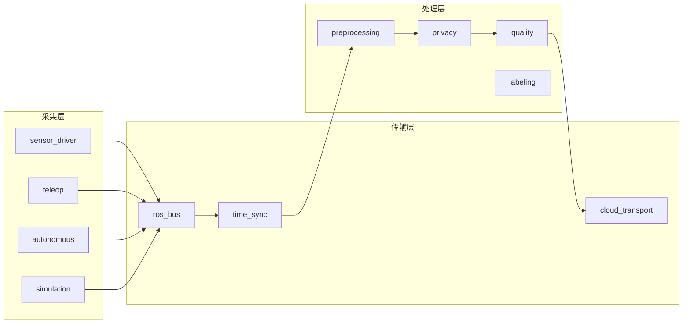
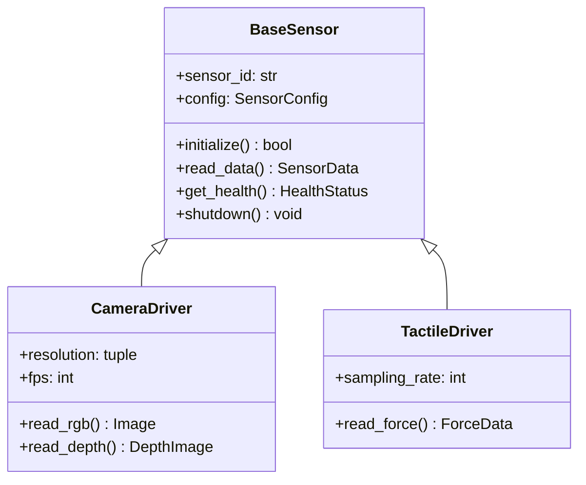

# 具身智能通用家庭机器人数据采集系统 - 开发架构设计

**版本**：V1.0  
**日期**：2026年1月  
**适用对象**：软件开发工程师、系统架构师、算法工程师  
**关联文档**：《具身智能通用家庭机器人数据采集系统_设计实现文档_V2.0》

---

## 目录

- [第一章：文档概述](#第一章文档概述)
- [第二章：系统总体架构](#第二章系统总体架构)
- [第三章：模块功能拆分](#第三章模块功能拆分)
- [第四章：核心接口设计](#第四章核心接口设计)
- [第五章：代码目录结构](#第五章代码目录结构)
- [第六章：技术选型与依赖](#第六章技术选型与依赖)
- [第七章：开发规范](#第七章开发规范)
- [第八章：附录](#第八章附录)

---

## 第一章：文档概述

### 1.1 目的与范围

本文档从**开发编码人员**的视角，对《具身智能通用家庭机器人数据采集系统_设计实现文档_V2.0》进行功能拆分和模块化架构设计，为开发团队提供：

- **模块划分指南**：明确各功能模块边界与职责
- **接口规范定义**：统一模块间通信协议与数据格式
- **代码组织结构**：标准化项目目录与包结构
- **技术选型参考**：指导开发语言、框架与工具选择
- **开发规范约定**：确保代码质量与团队协作效率

### 1.2 读者对象

| 角色 | 关注内容 |
|------|----------|
| **后端开发工程师** | 模块接口、数据处理流水线、存储方案 |
| **嵌入式开发工程师** | 传感器驱动、边缘计算、ROS节点开发 |
| **算法工程师** | 数据Schema、标注格式、训练友好输出 |
| **前端开发工程师** | 管理界面、WebSocket通信、可视化组件 |
| **DevOps工程师** | 部署架构、CI/CD流程、监控告警 |

### 1.3 术语定义

| 术语 | 说明 |
|------|------|
| **Episode** | 一次完整任务执行的数据记录单元 |
| **Chunk** | Episode的子窗口，训练消费的最小单元（T=16/32/64 steps） |
| **VLA** | Vision-Language-Action，视觉-语言-动作端到端模型 |
| **PTP** | Precision Time Protocol，IEEE 1588精确时间协议 |
| **QoS** | Quality of Service，ROS 2服务质量策略 |
| **DDS** | Data Distribution Service，ROS 2底层通信中间件 |

### 1.4 文档约定

- **模块命名**：采用 `<层级>_<功能>_module` 格式，如 `acquisition_teleop_module`
- **接口命名**：ROS Topic使用 `/namespace/module/data_type` 格式
- **代码语言**：核心逻辑使用Python 3.10+，性能敏感模块使用C++17
- **配置格式**：统一使用YAML格式

---

## 第二章：系统总体架构

### 2.1 五层分层架构

系统采用**"采集-传输-处理-存储-管理"五层架构**，各层职责明确、接口解耦。

```
┌─────────────────────────────────────────────────────────────────────┐
│                         管理层 (Management)                          │
│  ┌─────────────┐ ┌─────────────┐ ┌─────────────┐ ┌─────────────┐   │
│  │ 任务管理     │ │ 设备监控     │ │ 权限控制     │ │ 运维助手     │   │
│  │ TaskMgr     │ │ DeviceMon   │ │ AccessCtrl  │ │ OpsAssist   │   │
│  └─────────────┘ └─────────────┘ └─────────────┘ └─────────────┘   │
├─────────────────────────────────────────────────────────────────────┤
│                         存储层 (Storage)                             │
│  ┌─────────────┐ ┌─────────────┐ ┌─────────────┐ ┌─────────────┐   │
│  │ 边缘缓存     │ │ 云端存储     │ │ 版本管理     │ │ 格式转换     │   │
│  │ EdgeCache   │ │ CloudStore  │ │ VersionCtrl │ │ FormatConv  │   │
│  └─────────────┘ └─────────────┘ └─────────────┘ └─────────────┘   │
├─────────────────────────────────────────────────────────────────────┤
│                         处理层 (Processing)                          │
│  ┌───────────┐ ┌───────────┐ ┌───────────┐ ┌───────────┐           │
│  │ 预处理     │ │ 时间同步   │ │ 隐私脱敏   │ │ 质量门禁   │           │
│  │ PreProc   │ │ TimeSync  │ │ Privacy   │ │ QualityGate│           │
│  └───────────┘ └───────────┘ └───────────┘ └───────────┘           │
│  ┌───────────┐ ┌───────────┐                                        │
│  │ 自动标注   │ │ 语义去重   │                                        │
│  │ AutoLabel │ │ SemanticDe │                                        │
│  └───────────┘ └───────────┘                                        │
├─────────────────────────────────────────────────────────────────────┤
│                         传输层 (Transmission)                        │
│  ┌─────────────┐ ┌─────────────┐ ┌─────────────┐                    │
│  │ ROS消息总线  │ │ 云端传输     │ │ 加密通道     │                    │
│  │ ROSBus      │ │ CloudTrans  │ │ SecureChannel│                   │
│  └─────────────┘ └─────────────┘ └─────────────┘                    │
├─────────────────────────────────────────────────────────────────────┤
│                         采集层 (Acquisition)                         │
│  ┌─────────────┐ ┌─────────────┐ ┌─────────────┐ ┌─────────────┐   │
│  │ 遥操作采集   │ │ 自主采集     │ │ 仿真采集     │ │ 传感器驱动   │   │
│  │ Teleop      │ │ Autonomous  │ │ Simulation  │ │ SensorDrv   │   │
│  └─────────────┘ └─────────────┘ └─────────────┘ └─────────────┘   │
└─────────────────────────────────────────────────────────────────────┘
```

### 2.2 层级职责分配

| 层级 | 核心职责 | 部署位置 | 关键技术 |
|------|---------|---------|---------|
| **采集层** | 多模态数据获取 | 边缘端（机器人） | ROS 2, 传感器SDK |
| **传输层** | 数据同步与传输 | 边缘端 + 云端 | DDS, MQTT, TLS |
| **处理层** | 预处理与质量控制 | 边缘端（实时） + 云端（批量） | OpenCV, TensorRT, VLM |
| **存储层** | 分层存储管理 | 边缘端SSD + 云端OSS | HDF5, WebDataset, Parquet |
| **管理层** | 任务编排与监控 | 云端 + 本地Web | FastAPI, React, Grafana |

### 2.3 边缘-云协同架构

```
┌────────────────────────────────────────────────────────────────────┐
│                          云端 (Cloud)                               │
│  ┌──────────────────────────────────────────────────────────────┐  │
│  │  数据湖 (OSS/S3)    GPU集群 (模型训练)    API服务 (VLM标注)    │  │
│  │  数据管理平台        版本控制系统          运维监控中心         │  │
│  └──────────────────────────────────────────────────────────────┘  │
│                          ↑ MQTT/TLS 加密传输                        │
│                          ↓ 模型/配置下发                            │
├────────────────────────────────────────────────────────────────────┤
│                          边缘 (Edge)                                │
│  ┌──────────────────────────────────────────────────────────────┐  │
│  │                   NVIDIA Jetson Orin                         │  │
│  │  ┌────────────┐ ┌────────────┐ ┌────────────┐               │  │
│  │  │ 实时预处理  │ │ 隐私脱敏    │ │ 本地缓存    │               │  │
│  │  │            │ │ (<40ms)    │ │ (2TB SSD)  │               │  │
│  │  └────────────┘ └────────────┘ └────────────┘               │  │
│  │  ┌────────────┐ ┌────────────┐ ┌────────────┐               │  │
│  │  │ 时间同步    │ │ 质量监控    │ │ 智能压缩    │               │  │
│  │  │ (PTP)      │ │            │ │ (H.265)    │               │  │
│  │  └────────────┘ └────────────┘ └────────────┘               │  │
│  └──────────────────────────────────────────────────────────────┘  │
│                          ↑ USB 3.0 / Ethernet / CAN                 │
│                          ↓ 控制指令                                  │
├────────────────────────────────────────────────────────────────────┤
│                          采集端 (End)                               │
│  ┌──────────────────────────────────────────────────────────────┐  │
│  │  RGB-D相机×4    触觉传感器×2    麦克风阵列    IMU+编码器        │  │
│  │  六维力传感器    遥操作设备(VR)                                 │  │
│  └──────────────────────────────────────────────────────────────┘  │
└────────────────────────────────────────────────────────────────────┘
```

### 2.4 数据流向图

```
┌─────────────────────────────────────────────────────────────────────┐
│                         完整数据流                                   │
├─────────────────────────────────────────────────────────────────────┤
│                                                                     │
│  [传感器]──→[ROS节点]──→[Sync对齐]──→[隐私脱敏]──→[质量检测]         │
│      │                                              │               │
│      ↓                                              ↓               │
│  原始数据                                      ┌────────────┐       │
│  (高频/多源)                                   │ 边缘缓存    │       │
│                                               │ (2TB SSD)  │       │
│                                               └─────┬──────┘       │
│                                                     │               │
│                    ┌────────────────────────────────┼───────────┐   │
│                    │            网络传输            │           │   │
│                    │   (根据带宽自适应:全量/抽样/仅元数据)        │   │
│                    └────────────────────────────────┼───────────┘   │
│                                                     ↓               │
│                                               ┌────────────┐       │
│                                               │ 云端存储    │       │
│                                               └─────┬──────┘       │
│                                                     ↓               │
│                     [VLM标注]──→[语义去重]──→[格式转换]──→[训练]    │
│                                                                     │
└─────────────────────────────────────────────────────────────────────┘
```

### 2.5 系统组件关系



---

## 第三章：模块功能拆分

### 3.1 采集层模块

#### 3.1.1 传感器驱动模块 (sensor_driver)

**职责**：管理所有传感器的初始化、数据采集、状态监控。

| 子模块 | 职责 | 输出Topic | 频率 |
|--------|------|-----------|------|
| `camera_driver` | RGB-D相机数据采集 | `/sensor/camera/<id>/rgb`<br>`/sensor/camera/<id>/depth` | 30Hz |
| `tactile_driver` | 触觉传感器数据采集 | `/sensor/tactile/<id>/force` | 200Hz |
| `audio_driver` | 麦克风阵列数据采集 | `/sensor/audio/raw` | 16kHz |
| `imu_driver` | IMU数据采集 | `/sensor/imu/data` | 1000Hz |
| `force_torque_driver` | 六维力传感器采集 | `/sensor/ft/wrench` | 100Hz |
| `joint_state_driver` | 关节编码器数据采集 | `/robot/joint_states` | 1000Hz |

**核心类设计**：

```python
# sensor_driver/base_sensor.py
from abc import ABC, abstractmethod

class BaseSensor(ABC):
    """传感器基类"""
    
    def __init__(self, sensor_id: str, config: SensorConfig):
        self.sensor_id = sensor_id
        self.config = config
        self.health_status = HealthStatus.UNKNOWN
    
    @abstractmethod
    def initialize(self) -> bool:
        """初始化传感器硬件"""
        pass
    
    @abstractmethod
    def read_data(self) -> SensorData:
        """读取传感器数据"""
        pass
    
    @abstractmethod
    def get_health(self) -> HealthStatus:
        """获取传感器健康状态"""
        pass
    
    def shutdown(self) -> None:
        """安全关闭传感器"""
        pass
```

**配置文件示例**：

```yaml
# config/sensors.yaml
sensors:
  cameras:
    - id: "head_left"
      type: "realsense_d455"
      serial: "xxxx"
      resolution: [1920, 1080]
      fps: 30
      enable_depth: true
    - id: "wrist_left"
      type: "realsense_d455"
      serial: "yyyy"
      resolution: [1280, 720]
      fps: 30
  
  tactile:
    - id: "left_finger"
      type: "gelsight_mini"
      port: "/dev/ttyUSB0"
      sampling_rate: 200
```

---

#### 3.1.2 遥操作采集模块 (teleop_acquisition)

**职责**：管理遥操作设备接入、主从映射、数据录制。

| 子模块 | 职责 | 接口 |
|--------|------|------|
| `master_device` | 主端设备驱动（VR/动捕） | `/teleop/master/pose` |
| `slave_controller` | 从端机器人控制 | `/teleop/slave/cmd` |
| `motion_mapper` | 主从动作映射 | 内部服务 |
| `recording_manager` | 录制会话管理 | `/teleop/recording/status` |

**核心流程**：

```
[VR/动捕设备] → [master_device] → [motion_mapper] → [slave_controller] → [机器人执行]
                                        ↓
                              [recording_manager] → [数据录制]
```

**关键接口**：

```python
# teleop_acquisition/motion_mapper.py
class MotionMapper:
    """主从动作映射器"""
    
    def __init__(self, config: MapperConfig):
        self.arm_offset = config.arm_offset
        self.gripper_scale = config.gripper_scale
        self.safety_limits = config.safety_limits
    
    def map_pose(self, master_pose: Pose) -> Pose:
        """将主端位姿映射到从端目标位姿"""
        slave_pose = self._apply_transform(master_pose)
        slave_pose = self._apply_safety_limits(slave_pose)
        return slave_pose
    
    def map_gripper(self, master_gripper: float) -> float:
        """映射夹爪开合度 [0,1]"""
        return np.clip(master_gripper * self.gripper_scale, 0, 1)
```

---

#### 3.1.3 自主采集模块 (autonomous_acquisition)

**职责**：管理机器人自主运行时的数据回流采集。

| 子模块 | 职责 | 触发条件 |
|--------|------|---------|
| `trigger_manager` | 采集触发策略管理 | 任务事件/环境变化/定时/异常 |
| `value_estimator` | 数据价值评估 | 模型不确定性/OOD检测 |
| `shadow_mode` | 影子模式后台运行 | 持续运行 |

**采集触发策略**：

```python
# autonomous_acquisition/trigger_manager.py
class TriggerManager:
    """采集触发策略管理器"""
    
    TRIGGER_TYPES = [
        "task_event",      # 任务开始/结束/关键步骤
        "env_change",      # 光照突变、物体移动
        "periodic",        # 每5分钟环境快照
        "anomaly",         # 碰撞、任务失败
        "value_based"      # 高价值数据主动采集
    ]
    
    def should_record(self, observation: Observation) -> Tuple[bool, str]:
        """判断是否应该录制当前观测"""
        for trigger in self.triggers:
            if trigger.check(observation):
                return True, trigger.name
        
        # 基于价值的采集
        value = self.value_estimator.estimate(observation)
        if value > self.config.value_threshold:
            return True, "high_value"
        
        return False, None
```

---

#### 3.1.4 仿真采集模块 (simulation_acquisition)

**职责**：管理Isaac Sim仿真环境的数据生成。

| 子模块 | 职责 |
|--------|------|
| `sim_environment` | 仿真环境管理 |
| `domain_randomizer` | 域随机化配置 |
| `sim_sensor` | 仿真传感器数据渲染 |
| `sim_recorder` | 仿真数据录制 |

**域随机化配置**：

```python
# simulation_acquisition/domain_randomizer.py
@dataclass
class DomainRandomizationConfig:
    """域随机化配置"""
    # 视觉随机化
    lighting_intensity: Tuple[float, float] = (0.2, 1.5)
    texture_randomize: bool = True
    
    # 物理随机化
    friction: Tuple[float, float] = (0.3, 1.2)
    mass_scale: Tuple[float, float] = (0.8, 1.2)
    
    # 几何随机化
    object_position_noise: float = 0.05  # 5cm
    object_orientation_noise: float = 15  # 15度
```

---

### 3.2 传输层模块

#### 3.2.1 ROS消息总线模块 (ros_bus)

**职责**：管理ROS 2节点间通信、消息路由、QoS配置。

**QoS配置策略**：

```python
# ros_bus/qos_profiles.py
from rclpy.qos import QoSProfile, ReliabilityPolicy, HistoryPolicy

# 传感器数据：高频、允许丢帧
SENSOR_QOS = QoSProfile(
    reliability=ReliabilityPolicy.BEST_EFFORT,
    history=HistoryPolicy.KEEP_LAST,
    depth=10
)

# 控制指令：可靠传输
CONTROL_QOS = QoSProfile(
    reliability=ReliabilityPolicy.RELIABLE,
    history=HistoryPolicy.KEEP_LAST,
    depth=10
)
```

---

#### 3.2.2 时间同步模块 (time_sync)

**职责**：实现多传感器数据的精确时间对齐。

| 子模块 | 职责 | 精度要求 |
|--------|------|---------|
| `ptp_manager` | PTP协议管理（硬件同步） | <100μs |
| `software_sync` | 软件时间戳插值（备选） | <10ms |
| `sync_validator` | 同步质量验证 | - |

**同步等级分层**：

| 等级 | 精度 | 适用模态 |
|------|------|---------|
| L0_STRONG | <1ms | 控制/关节/力触觉 |
| L1_MEDIUM | <10ms | RGB ↔ 关节 |
| L2_WEAK | <100ms | 音频/环境 |

**多模态对齐器**：

```python
# time_sync/multimodal_aligner.py
class MultimodalAligner:
    """多模态数据对齐器"""
    
    def align(self, data_streams: Dict[str, DataStream]) -> AlignedData:
        """将所有模态对齐到参考时间轴"""
        ref_timestamps = data_streams["joint_states"].timestamps
        aligned = {}
        
        for modality, stream in data_streams.items():
            if modality in ["rgb", "depth"]:
                # 图像：最近邻插值
                aligned[modality] = self._nearest_interpolate(stream, ref_timestamps)
            else:
                # 数值：线性插值
                aligned[modality] = self._linear_interpolate(stream, ref_timestamps)
        
        return AlignedData(timestamps=ref_timestamps, modalities=aligned)
```

---

#### 3.2.3 云端传输模块 (cloud_transport)

**职责**：管理边缘到云端的数据传输。

| 子模块 | 职责 |
|--------|------|
| `mqtt_client` | MQTT连接管理 |
| `adaptive_uploader` | 自适应上传策略 |
| `resume_manager` | 断点续传管理 |

**自适应上传策略**：

| 网络状态 | 策略 | 上传内容 |
|---------|------|---------|
| >10Mbps | full | 原始RGB-D+全量数据 |
| 2-10Mbps | sampled | 关键帧(1fps)+状态数据 |
| <2Mbps | metadata | 任务摘要+关键事件 |

---

### 3.3 处理层模块

#### 3.3.1 数据预处理模块 (preprocessing)

**职责**：数据清洗、格式转换、降采样。

| 子模块 | 功能 |
|--------|------|
| `image_processor` | 图像去噪、降采样、格式转换 |
| `depth_processor` | 深度图空洞填充、滤波 |
| `audio_processor` | 音频降噪、VAD分割 |
| `trajectory_processor` | 轨迹平滑、异常检测 |

---

#### 3.3.2 隐私脱敏模块 (privacy_filter)

**职责**：实时检测并处理敏感信息。

| 子模块 | 功能 | 延迟要求 |
|--------|------|---------|
| `face_detector` | 人脸检测 | <20ms |
| `face_blurrer` | 人脸模糊处理 | <10ms |
| `text_detector` | 敏感文字检测 | <30ms |
| `voice_anonymizer` | 声纹匿名化 | <50ms |

**隐私脱敏引擎**：

```python
# privacy_filter/privacy_engine.py
class PrivacyEngine:
    """隐私脱敏引擎"""
    
    def process_image(self, image: np.ndarray) -> np.ndarray:
        # 1. 检测并模糊人脸
        faces = self.face_detector.detect(image)
        for face_bbox in faces:
            image = self._blur_region(image, face_bbox)
        
        # 2. 检测并遮挡敏感文字
        texts = self.text_detector.detect(image)
        for text_box in texts:
            if self._contains_sensitive(text_box.content):
                image = self._mask_region(image, text_box.bbox)
        
        return image
```

---

#### 3.3.3 质量门禁模块 (quality_gate)

**职责**：评估数据质量，实现分级标记。

| 质量等级 | 技术指标 | 用途 |
|---------|---------|------|
| **A级** | 同步误差<5ms，无模糊 | 直接入训练集 |
| **B级** | 同步误差<10ms，轻微模糊 | 人工复核后入库 |
| **C级** | 同步误差>10ms，质量差 | 仅归档不训练 |
| **D级** | 数据缺失 | 丢弃 |

---

#### 3.3.4 自动标注模块 (auto_labeling)

**职责**：利用VLM模型进行自动标注。

| 子模块 | 功能 |
|--------|------|
| `keyframe_extractor` | 关键帧提取 |
| `vlm_annotator` | VLM语义标注 |
| `cot_generator` | 思维链生成 |
| `confidence_estimator` | 标注置信度评估 |

---

### 3.4 存储层模块

#### 3.4.1 边缘缓存模块 (edge_cache)

**职责**：管理边缘端本地数据缓存。

| 子模块 | 功能 |
|--------|------|
| `cache_manager` | 缓存空间管理 |
| `eviction_policy` | 过期数据清理策略 |
| `integrity_checker` | 数据完整性校验 |

**缓存配置**：

```yaml
# config/edge_cache.yaml
edge_cache:
  capacity: "2TB"
  retention_days: 7
  eviction_policy: "oldest_first"
  integrity_check_interval: "1h"
```

---

#### 3.4.2 云端存储模块 (cloud_storage)

**职责**：管理云端数据存储与检索。

| 子模块 | 功能 |
|--------|------|
| `oss_client` | OSS/S3客户端 |
| `indexer` | 数据索引服务 |
| `lifecycle_manager` | 数据生命周期管理 |

**三层存储策略**：

| 层级 | 存储类型 | 保留期限 | 成本 |
|------|---------|---------|------|
| 热数据 | 标准存储 | 7天 | 高 |
| 温数据 | 低频访问 | 30天 | 中 |
| 冷数据 | 归档存储 | 长期 | 低 |

---

#### 3.4.3 格式转换模块 (format_converter)

**职责**：数据格式转换，生成训练友好输出。

| 输入格式 | 输出格式 | 用途 |
|---------|---------|------|
| MCAP (ROSbag2) | WebDataset | PyTorch流式训练 |
| MCAP | HDF5 | 离线分析 |
| MCAP | Parquet | 数据仓库 |

---

### 3.5 管理层模块

#### 3.5.1 任务管理模块 (task_manager)

**职责**：管理采集任务的全生命周期。

| 子模块 | 功能 |
|--------|------|
| `task_scheduler` | 任务调度器 |
| `workflow_engine` | 工作流引擎 |
| `progress_tracker` | 进度追踪 |

**任务状态机**：

```
[待分配] → [进行中] → [已完成]
     ↓         ↓
  [已取消] ← [暂停中]
```

---

#### 3.5.2 设备监控模块 (device_monitor)

**职责**：监控所有设备状态与健康度。

| 监控项 | 正常范围 | 异常阈值 |
|-------|---------|---------|
| 传感器帧率 | ≥25fps | <20fps |
| 设备温度 | <55°C | >60°C |
| CPU占用率 | <70% | >85% |
| 磁盘剩余空间 | >20% | <10% |

---

#### 3.5.3 权限控制模块 (access_control)

**职责**：管理用户权限与数据访问。

| 角色 | 权限 |
|------|------|
| `admin` | 全部权限 |
| `operator` | 采集、查看 |
| `analyst` | 查看、导出 |
| `viewer` | 仅查看 |

---

## 第四章：核心接口设计

### 4.1 ROS 2节点接口规范

#### 4.1.1 Topic命名规范

```
/<namespace>/<module>/<data_type>

示例：
/data_collection/camera/head_left/rgb
/data_collection/tactile/left_finger/force
/data_collection/robot/joint_states
/data_collection/teleop/master/pose
```

#### 4.1.2 核心节点列表

| 节点名称 | 发布Topic | 订阅Topic | 频率 |
|---------|-----------|-----------|------|
| `camera_node` | `/camera/<id>/rgb`, `/camera/<id>/depth` | - | 30Hz |
| `tactile_node` | `/tactile/<id>/force` | - | 200Hz |
| `joint_state_node` | `/robot/joint_states` | - | 100Hz |
| `teleop_master_node` | `/teleop/master/pose` | `/robot/state` | 60Hz |
| `sync_align_node` | `/synced_data` | 所有传感器topic | 30Hz |
| `privacy_filter_node` | `/filtered/rgb` | `/camera/<id>/rgb` | 30Hz |
| `quality_gate_node` | `/quality_report` | `/synced_data` | 30Hz |
| `data_recorder_node` | - | `/synced_data` | 30Hz |

---

### 4.2 数据Schema定义

#### 4.2.1 Episode数据结构

```json
{
    "episode_id": "ep_20260105_001",
    "session_id": "session_kitchen_001",
    "timestamp": 1736083200.123,
    "data_source": "real",
    
    "scene_metadata": {
        "scene_id": "home_kitchen_01",
        "scene_type": "kitchen",
        "lighting_condition": "natural_daylight"
    },
    
    "task_metadata": {
        "task_id": "task_pick_cup",
        "task_description": "拿起桌上的水杯",
        "outcome": "success"
    },
    
    "observations": {
        "rgb": {"head_left": "path/to/image.png"},
        "depth": {"head_left": "path/to/depth.png"},
        "joint_states": {
            "positions": [0.1, 0.2, 0.3, 0.4, 0.5, 0.6],
            "velocities": [0.01, 0.02, 0.01, 0.0, 0.0, 0.0],
            "efforts": [0.5, 0.8, 0.3, 0.1, 0.1, 0.2]
        },
        "tactile": {"left_finger": "path/to/tactile.bin"}
    },
    
    "actions": {
        "canonical_action": {
            "ee_delta": [0.01, 0.02, 0.0, 0.0, 0.0, 0.01],
            "gripper_state": 0.8,
            "coordinate_frame": "base_link"
        }
    },
    
    "annotations": {
        "action_label": "grasp",
        "cot": [
            {"step": 1, "type": "perception", "belief": "cup_on_table"},
            {"step": 2, "type": "planning", "intent": "grasp_handle"},
            {"step": 3, "type": "execution", "action": "close_gripper"}
        ]
    },
    
    "quality_metadata": {
        "quality_grade": "A",
        "sync_error_ms": 5.2
    }
}
```

#### 4.2.2 训练字段契约

| 字段类型 | 字段名 | 说明 |
|---------|-------|------|
| **Hard-Required** | `episode_id` | 唯一标识 |
| **Hard-Required** | `observations.joint_states` | 机器人状态 |
| **Hard-Required** | `actions.canonical_action` | 规范化动作 |
| **Hard-Required** | `timestamp` | 时间戳 |
| **Soft-Required** | `observations.rgb` | 视觉输入 |
| **Optional** | `annotations.cot` | 思维链标注 |
| **Never-Train** | `raw_action` | 原始设备动作 |
| **Never-Train** | `privacy_*` | 敏感数据 |

---

### 4.3 服务接口定义

#### 4.3.1 REST API接口

| 接口 | 方法 | 功能 |
|------|------|------|
| `/api/v1/tasks` | GET/POST | 任务列表/创建任务 |
| `/api/v1/tasks/{id}` | GET/PUT/DELETE | 任务详情/更新/删除 |
| `/api/v1/tasks/{id}/start` | POST | 启动采集 |
| `/api/v1/tasks/{id}/stop` | POST | 停止采集 |
| `/api/v1/devices` | GET | 设备列表 |
| `/api/v1/devices/{id}/health` | GET | 设备健康状态 |
| `/api/v1/episodes` | GET | Episode列表 |
| `/api/v1/episodes/{id}` | GET | Episode详情 |

#### 4.3.2 WebSocket接口

| 接口 | 功能 |
|------|------|
| `/ws/realtime/video` | 实时视频预览 |
| `/ws/realtime/status` | 系统状态推送 |
| `/ws/realtime/alerts` | 告警消息推送 |

---

## 第五章：代码目录结构

### 5.1 项目根目录组织

```
data_collection_system/
├── README.md                      # 项目说明
├── pyproject.toml                 # Python项目配置
├── setup.py                       # 安装脚本
├── docker/                        # Docker配置
│   ├── Dockerfile.edge            # 边缘端镜像
│   └── Dockerfile.cloud           # 云端镜像
├── config/                        # 配置文件
│   ├── sensors.yaml               # 传感器配置
│   ├── system.yaml                # 系统配置
│   └── privacy.yaml               # 隐私配置
├── launch/                        # ROS 2启动文件
│   ├── edge_system.launch.py
│   └── teleop_mode.launch.py
├── src/                           # 源代码
│   ├── acquisition/               # 采集层
│   ├── transmission/              # 传输层
│   ├── processing/                # 处理层
│   ├── storage/                   # 存储层
│   ├── management/                # 管理层
│   └── common/                    # 公共模块
├── tests/                         # 测试代码
├── docs/                          # 文档
└── scripts/                       # 脚本工具
```

### 5.2 各层模块包结构

#### 5.2.1 采集层 (src/acquisition/)

```
acquisition/
├── __init__.py
├── sensor_driver/
│   ├── __init__.py
│   ├── base_sensor.py
│   ├── camera_driver.py
│   ├── tactile_driver.py
│   ├── audio_driver.py
│   └── imu_driver.py
├── teleop/
│   ├── __init__.py
│   ├── master_device.py
│   ├── slave_controller.py
│   └── motion_mapper.py
├── autonomous/
│   ├── __init__.py
│   ├── trigger_manager.py
│   └── value_estimator.py
└── simulation/
    ├── __init__.py
    ├── sim_environment.py
    └── domain_randomizer.py
```

#### 5.2.2 处理层 (src/processing/)

```
processing/
├── __init__.py
├── preprocessing/
│   ├── __init__.py
│   ├── image_processor.py
│   ├── depth_processor.py
│   └── audio_processor.py
├── privacy/
│   ├── __init__.py
│   ├── privacy_engine.py
│   ├── face_detector.py
│   └── voice_anonymizer.py
├── quality/
│   ├── __init__.py
│   ├── quality_gate.py
│   └── quality_classifier.py
└── labeling/
    ├── __init__.py
    ├── vlm_annotator.py
    └── cot_generator.py
```

---

## 第六章：技术选型与依赖

### 6.1 开发语言

| 语言 | 使用场景 | 版本要求 |
|------|---------|---------|
| Python | 主要开发语言，数据处理、AI推理 | ≥3.10 |
| C++ | 性能敏感模块，传感器驱动 | C++17 |
| TypeScript | Web管理界面 | ≥5.0 |

### 6.2 核心框架

| 框架 | 用途 | 版本 |
|------|------|------|
| ROS 2 Humble | 机器人通信框架 | LTS 2027 |
| FastAPI | 后端API服务 | ≥0.100 |
| React | 前端管理界面 | ≥18.0 |
| PyTorch | AI推理 | ≥2.0 |

### 6.3 关键依赖库

| 类别 | 库名 | 用途 |
|------|------|------|
| **视觉** | OpenCV, realsense2 | 图像处理、相机驱动 |
| **AI** | PyTorch, TensorRT, transformers | 模型推理 |
| **数据** | h5py, webdataset, pandas | 数据格式处理 |
| **通信** | paho-mqtt, websockets | 云端通信 |
| **存储** | minio, boto3 | 对象存储客户端 |

### 6.4 第三方服务

| 服务 | 用途 | 备选方案 |
|------|------|---------|
| GPT-4V / Qwen-VL | VLM自动标注 | 本地部署开源VLM |
| 阿里云OSS / AWS S3 | 云端存储 | MinIO自建 |
| Grafana | 监控可视化 | 自研Dashboard |

---

## 第七章：开发规范

### 7.1 编码规范

**Python规范**：

- 遵循 PEP 8 风格指南
- 使用 Black 格式化工具
- 使用 mypy 进行类型检查
- 函数/类必须有 docstring

**C++规范**：

- 遵循 Google C++ 风格指南
- 使用 clang-format 格式化

### 7.2 命名约定

| 类型 | 规范 | 示例 |
|------|------|------|
| 模块名 | snake_case | `sensor_driver` |
| 类名 | PascalCase | `CameraDriver` |
| 函数名 | snake_case | `read_sensor_data()` |
| 常量 | UPPER_SNAKE | `MAX_BUFFER_SIZE` |
| ROS Topic | /namespace/module/type | `/camera/head_left/rgb` |

### 7.3 Git规范

**分支命名**：

- `main`: 主分支，稳定版本
- `develop`: 开发分支
- `feature/<name>`: 功能分支
- `bugfix/<name>`: 修复分支

**提交信息**：

```
<type>(<scope>): <subject>

feat(camera): add depth filtering support
fix(privacy): resolve face detection latency issue
docs(api): update REST API documentation
```

### 7.4 测试要求

| 测试类型 | 覆盖率要求 | 工具 |
|---------|-----------|------|
| 单元测试 | ≥80% | pytest |
| 集成测试 | 核心流程 | pytest + ROS 2 launch_testing |
| 性能测试 | 关键指标 | locust, custom scripts |

---

## 第八章：附录

### 8.1 模块依赖关系图



### 8.2 核心类继承关系



### 8.3 配置文件完整示例

```yaml
# config/system.yaml
system:
  node_name: "data_collection"
  log_level: "INFO"
  
edge:
  compute_device: "jetson_orin"
  storage_path: "/data/cache"
  cache_size_gb: 2000
  
cloud:
  enabled: true
  endpoint: "https://oss-cn-hangzhou.aliyuncs.com"
  bucket: "robot-data-collection"
  upload_strategy: "adaptive"
  
privacy:
  face_blur_enabled: true
  voice_anonymize_enabled: true
  sensitive_keywords: ["身份证", "银行卡", "密码"]
  
quality:
  sync_threshold_ms: 10
  image_sharpness_threshold: 100
  auto_grade_enabled: true
```

### 8.4 快速启动命令

```bash
# 1. 环境准备
source /opt/ros/humble/setup.bash
source install/setup.bash

# 2. 启动边缘端系统
ros2 launch data_collection edge_system.launch.py

# 3. 启动遥操作模式
ros2 launch data_collection teleop_mode.launch.py

# 4. 启动管理界面
cd src/management/web && npm run dev
```

---

**文档信息**

| 项目 | 内容 |
|------|------|
| 版本 | V1.0 |
| 日期 | 2026年1月7日 |
| 关联文档 | 《具身智能通用家庭机器人数据采集系统_设计实现文档_V2.0》 |

---

**文档结束**
